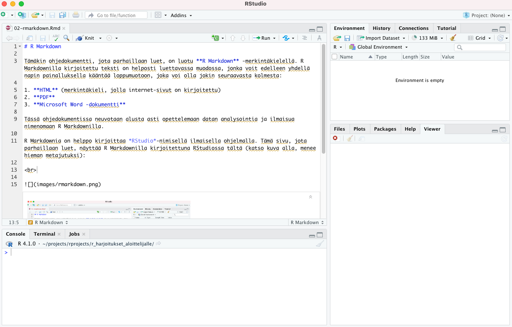

# R Markdown

Tämäkin ohjedokumentti, jota parhaillaan luet, on luotu **R Markdown** -merkintäkielellä. R Markdownilla kirjoitettu teksti on helposti luettavassa muodossa, ja voit edelleen kääntää sen yhdellä napin painalluksella loppumuotoon, joka voi olla jokin seuraavasta kolmesta:

1. **HTML** (merkintäkieli, jolla internet-sivut on kirjoitettu)
2. **PDF**
3. **Microsoft Word -dokumentti**

Tässä ohjedokumentissa neuvotaan alusta asti opettelemaan datan analysointia ja ilmaisua nimenomaan R Markdownilla.

R Markdownia on helppo kirjoittaa *RStudio*-nimisellä ilmaisella ohjelmalla. Tämä sivu, jota parhaillaan luet, näyttää R Markdownilla kirjoitettuna RStudiossa tältä (katso kuva alla, menee hieman "metajutuksi"):

 

 

<a property="dct:title" rel="cc:attributionURL" href="https://vldesign.kapsi.fi/r/">R-opas</a> by <a rel="cc:attributionURL dct:creator" property="cc:attributionName" href="http://www.linkedin.com/in/ville-langen">Ville Langén</a> is licensed under <a href="http://creativecommons.org/licenses/by-sa/4.0/?ref=chooser-v1" target="_blank" rel="license noopener noreferrer" style="display:inline-block;">Attribution-ShareAlike 4.0 International</a>

