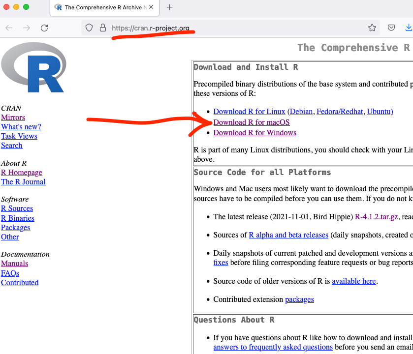
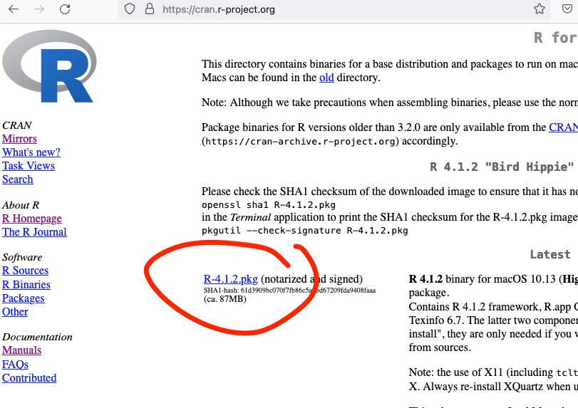
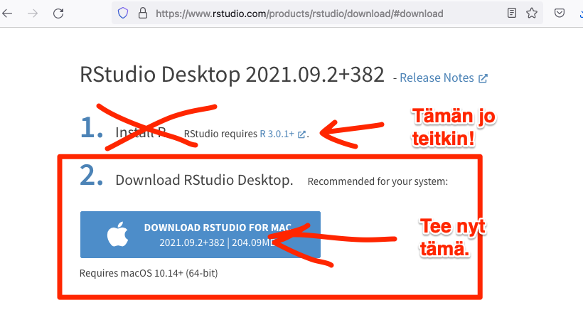

# Asennus tietokoneelle

Sinun tulee asentaa Maciisi seuraavat kaksi asennuspakettia (jos niitä ei ole jo asennettu):

1. R **(asenna tämä ensin)**, ja
2. RStudio.

Kummankin asentaminen on superhelppoa, siitä lisää seuraavassa.

## R-kielen asennus

Mene ensin saitille [https://cran.r-project.org/](https://cran.r-project.org/).

Klikkaa kohtaan "Download R for macOS".

 

 

Seuraavalla sivulla klikkaa ylimpään latauslinkkiin. Asenna latautuva paketti Maciisi.

 

## RStudion asennus

Asenna seuraavaksi RStudio koneellesi. Se tapahtuu seuraavasti:

Mene osoitteeseen [https://www.rstudio.com/products/rstudio/download/](https://www.rstudio.com/products/rstudio/download/).

Klikkaa Download-linkkiin ilmaisen "RStudio Desktop" kohdalla (katso kuva alla), asenna ohjelma Maciisi.

  

  

Kun painat linkkiä, saitti heittää sinun eteenpäin sivulla (katso alla oleva kuva). Saitti muistuttaa, että R pitää olla asennettuna, mutta sen jo teitkin. Paina linkkiä "DOWNLOAD RSTUDIO FOR MAC", ja RStudio... .dmg -niminen tiedosto siirtyy koneellesi, asenna siitä RStudio koneellesi.

 

 

<a property="dct:title" rel="cc:attributionURL" href="https://vldesign.kapsi.fi/r/">R-opas</a> by <a rel="cc:attributionURL dct:creator" property="cc:attributionName" href="http://www.linkedin.com/in/ville-langen">Ville Langén</a> is licensed under <a href="http://creativecommons.org/licenses/by-sa/4.0/?ref=chooser-v1" target="_blank" rel="license noopener noreferrer" style="display:inline-block;">Attribution-ShareAlike 4.0 International</a>

