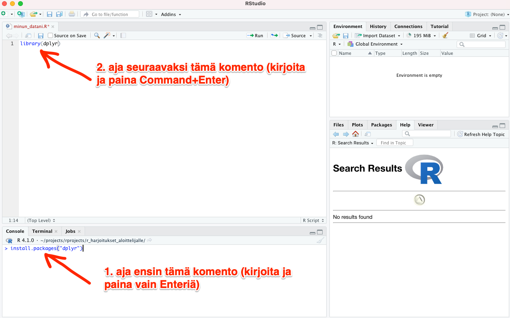

# R-skriptit

*R-skriptit* - eli R-ohjelmointikieltä sisältävät tekstitiedostot - ovat luonteeltaan ihan samanlaisia kuin vaikkapa Base SASin vastaavat tekstitiedostot, eli ne sisältävät yksinkertaisesti:

1. R-ohjelmointikielellä koodia
2. Koodin dokumentointia

    -- **Huom! Muista dokumentoida runsaasti**, jotta ymmärtäisit omaa koodiasi pitkänkin ajan kuluttua!

<br>

Dokumentointi tehdään R:ssä lisäämällä omien kommenttien eteen risuaita ```#```. Alla esimerkki R-skriptistä (sinun ei tarvitse ajaa tätä itse):

```
# Risuaidan jälkeen tuleva teksti ei ole koodia vaan omaa kommentointiasi.
# Seuraavalla rivillä sen sijaan on oikeaa ohjelmointikieltä:
print("Hello world")
```

<br>

Niin R-skriptejä kuin R Markdown -dokumenttejakin on kätevä tehdä RStudio-ohjelmalla, jota seuraavaksi käsittelemme.

## RStudion perusnäkymä

RStudiossa on monenlaista näkymää ja painiketta, mutta tarvitset ihan aluksi vain kahta (katso kuva alla):

1. Ikkunaa, johon kirjoitat R-skriptiäsi (ns. source window)
2. Console-ikkunaa

<br>


<br>

## R-skriptin luonti

Luo uusi **R-skripti (tiedostopääte .R)** valitsemalla RStudion valikosta *File --> New File --> R Script* (katso kuva alla):

<br>


<br>
<br>

Tallenna luomasi tyhjä R-skripti valitsemalla *File --> Save as...* ja antamalla tiedoston nimeksi:

*minun_datani.R*


## dplyr-paketin lataus

Datan käsittelyä R:ssä helpottaa huomattavasti apupaketti *dplyr*. Asenna se heti aluksi tietokoneellesi seuraavasti (katso alla oleva kuva): klikkaa RStudion vasemmassa alakulmassa tabia *Console*. Kirjoita siinä näkyvän merkin *>* perään seuraava käsky:

``` install.packages("dplyr") ```

Tämän jälkeen klikkaa takaisin RStudiossa dokumenttisi *minun_datani.R* puolelle. Kirjoita sen alkuun seuraava koodi, joka lataa *dplyr*-paketin tässä projektissa käytettäväksi:

``` library(dplyr) ```

**Kun olet kirjoittanut yllä olevan rivin, mene jonnekin kyseisen rivin kohdalle ja paina Macissa näppäinyhdistelmää** ***Cmd+Enter*** (Cmd on nelilehtisen apilan näköinen nappula). Näin tekemällä olet juuri ajanut kyseisen rivin ja *dplyr*-paketin toiminnot ovat käytettävissäsi.



<br>
<p xmlns:cc="http://creativecommons.org/ns#" xmlns:dct="http://purl.org/dc/terms/"><a property="dct:title" rel="cc:attributionURL" href="https://vldesign.kapsi.fi/r/">R-opas</a> by <a rel="cc:attributionURL dct:creator" property="cc:attributionName" href="http://www.linkedin.com/in/ville-langen">Ville Langén</a> is licensed under <a href="http://creativecommons.org/licenses/by-sa/4.0/?ref=chooser-v1" target="_blank" rel="license noopener noreferrer" style="display:inline-block;">Attribution-ShareAlike 4.0 International</a></p>

