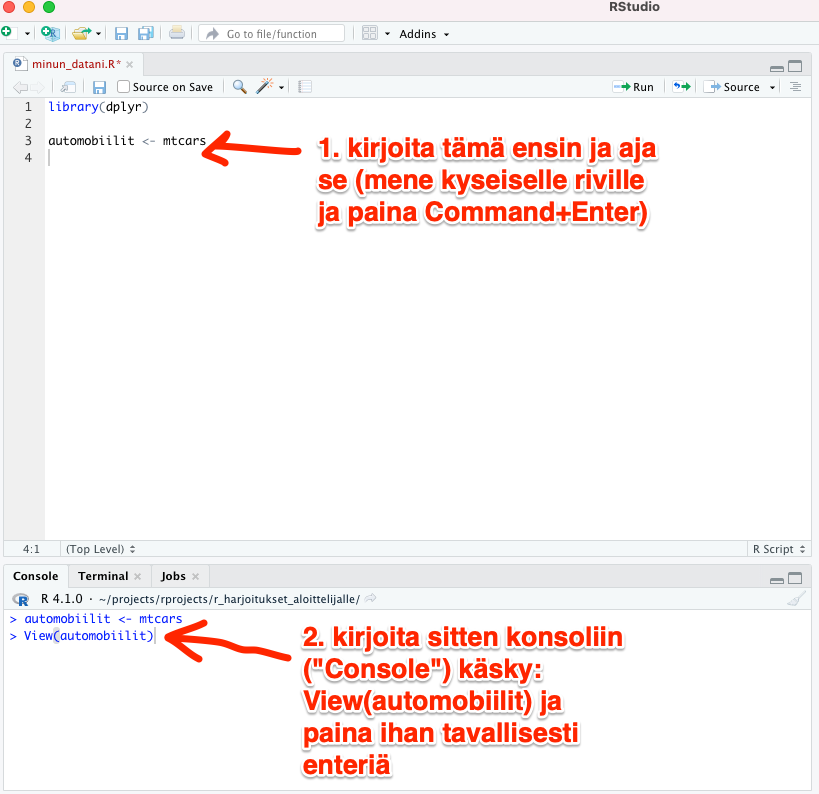
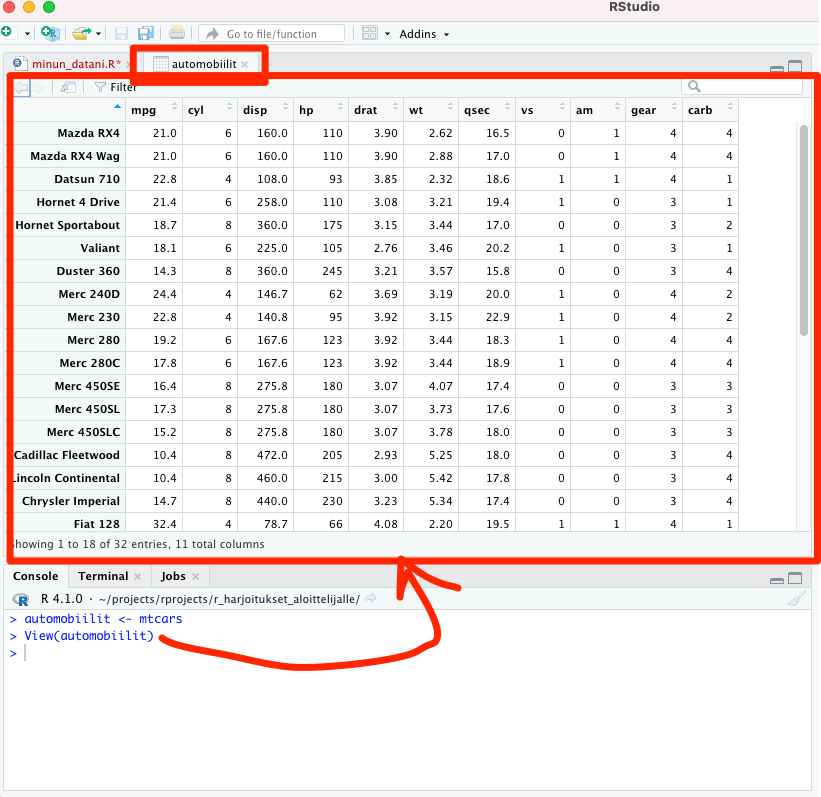
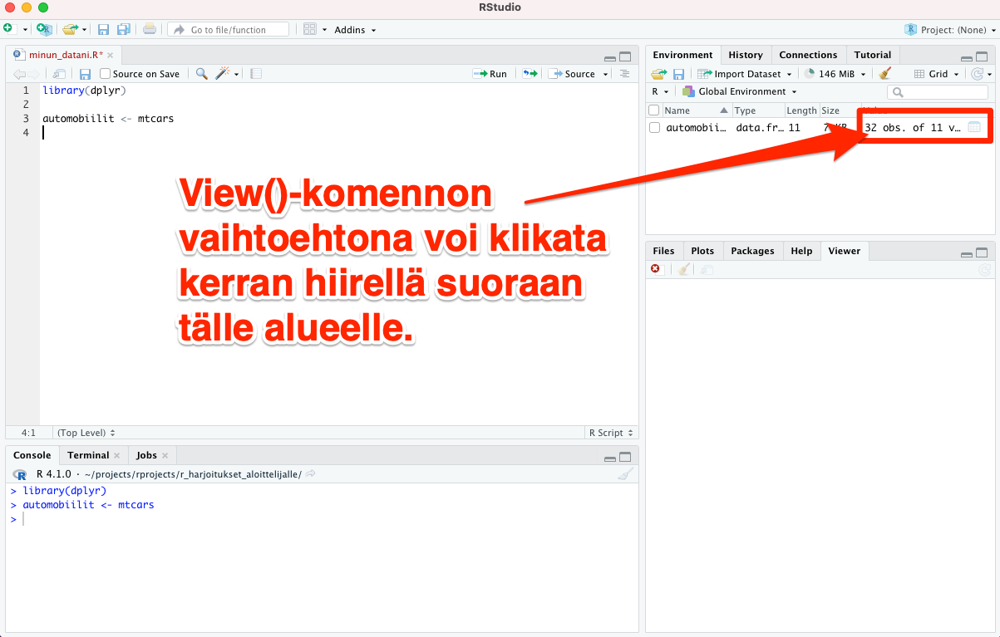
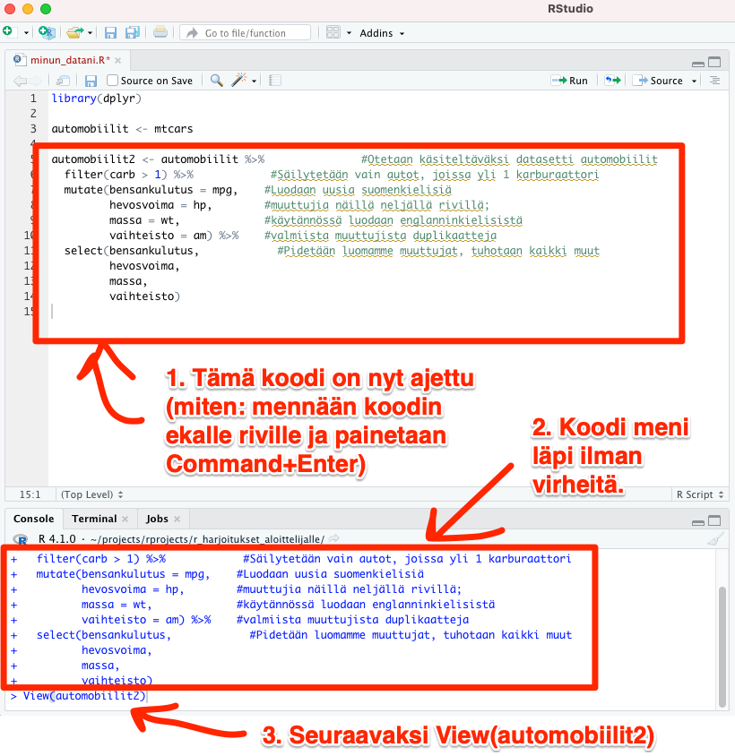
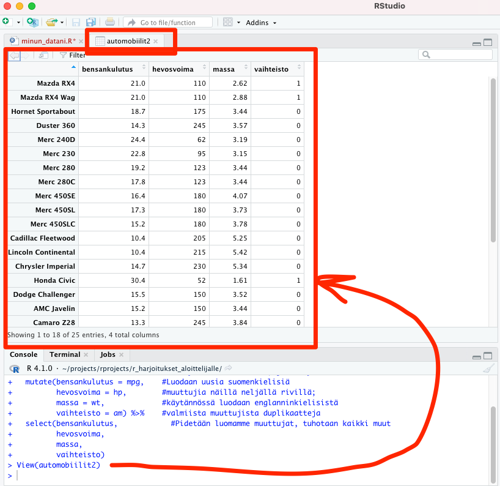
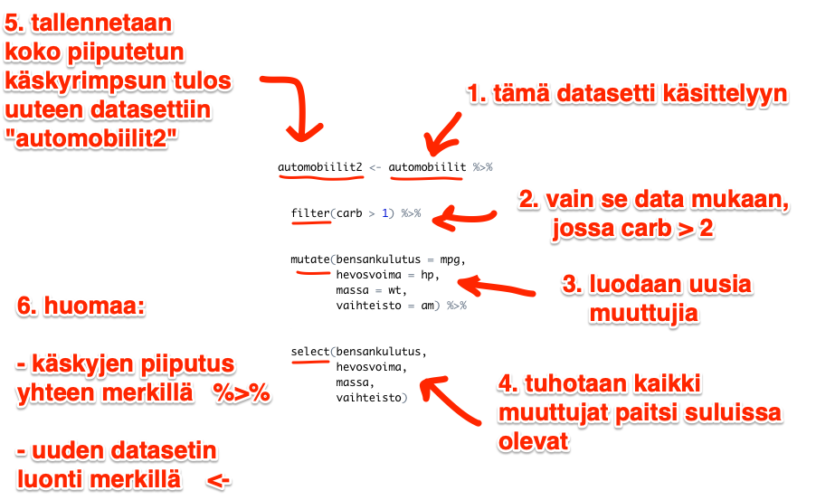

# Esimerkkidatasetti

R:n opettelussa kannattaa hyödyntää vapaasti käytettävissä olevia esimerkkidatasettejä. Valitaan *Motor Trend Car Road Tests* -niminen datasetti (lyhenne: *mtcars*), ja aletaan tarkastella ja käsitellä siinä olevia muuttujia.

Luodaan ensin uusi oma datasettimme *automobiilit*, johon *mtcars* kopioidaan sellaisenaan (katso kuva alla):

```automobiilit <- mtcars```

SASin käyttäjät ovat tottuneet tällaisessa datasetin luontitilanteessa näkemään uuden datasetin erityisessä SASin ikkunassa. RStudiossa saa ihan vastaavan ns. data view -näkymän aikaiseksi ajamalla vasemmalla alhaalla tabissä *Console* seuraavan komennon:

``` View(automobiilit) ```

<br>



<br><br>

Kun olet kirjoittanut View(automobiilit)-käskyn, avautuu seuraava näkymä (kuva alla):


<br>

Silmäile *View*-komennon aikaansaamaa data view -näkymää. Havaitset biostatistikon näkökulmasta seuraavat seikat:

1. "Koehenkilöt" ovat tässä tapauksessa automerkkejä, ja
2. "biomarkkereita" (muuttujia) ovat esim. hevosvoima, sylinterit jne.

**Huom! View()-komennon asemesta voit klikata hiiren vasemmalla napilla tarkasteltavan datasetin "Value"-sarakkeeseen, tämä tekee saman kuin View()-komento (katso kuva alla):**

<br>



## Datan muokkaus dplyr:illa

Yksinkertaistetaan datasettiämme. Säilytetään vain seuraavat neljä muuttujaa ja nimetään ne suomeksi:

1. bensankulutusta kuvaava *mpg*,
2. hevosvoimaa kuvaava *hp*,
3. massa *wt* sekä
4. vaihteistotyyppi *am* (automaattinen vs. manuaalinen vaihteisto).

Tämän lisäksi harjoituksen vuoksi:

- Suljemme datasetistämme pois kaikki sellaiset autot, joissa ei ole käytössä vähintään 2 karburaattoria.
   - Huom! Jos et tiedä mikä on karburaattori, tällä ei ole mitään väliä. Yhtä hyvin tämä voisi olla "oltava enemmän kuin yksi munuainen tutkittavalla potilaalla" jossakin toisessa datasetissä.


*dplyr*-paketin komennoilla yllä mainittujen asioiden toteuttaminen on erittäin helppoa. Kirjoita seuraavat rivit R-skriptiisi *minun_datani.R*. Voit copy-pastettaa ne suoraan tästä alta, jos luet tämän pikaohjeen elektronista versiota.

Huom. katso myös kuva alempana:

```
automobiilit2 <- automobiilit %>%               #Otetaan käsiteltäväksi datasetti automobiilit
                    filter(carb > 1) %>%            #Säilytetään vain autot, joissa yli 1 karburaattori
                       mutate(bensankulutus = mpg,    #Luodaan uusia suomenkielisiä
                              hevosvoima = hp,        #muuttujia näillä neljällä rivillä;
                              massa = wt,             #käytännössä luodaan englanninkielisistä
                              vaihteisto = am) %>%    #valmiista muuttujista duplikaatteja
                       select(bensankulutus,            #Pidetään luomamme muuttujat, tuhotaan kaikki muut
                              hevosvoima,
                              massa,
                              vaihteisto)
                                                              
```

Aja syöttämäsi rivit: voit joko maalata hiirellä koko rimpsun ja ajaa sen näppäinyhdistelmällä Command+Enter tai mennä vain kyseisen rivistön ensimmäiselle riville ja painaa Command+Enter.

<br>




<br>


Tarkastele luomaasi datasettiä tämän jälkeen ajamalla konsolissa *View*-komento, tällä kertaa uudesta datasetistä *automobiilit2*:

``` View(automobiilit2) ```

Huomaat, että ajamasi koodi on toiminut toivotulla tavalla (katso kuva alla).

<br>




## Kertausta dplyr:ista

*dplyr:*ia käytettäessä erilaiset käskyt (yllä: ```filter```, ```mutate``` sekä ```select```) syötetään "putkea" pitkin peräkanaa tapahtuvaksi sijoittamalla kunkin käskyn väliin aina seuraava operaattori (eli merkkikombinaatio): ``` %>% ```.

Vielä kertauksena *dplyr*:llä tehdyn käskyputken toiminta (katso myös kuva alla):

1. ```filter```: suljetaan datastamme jotain pois (tässä esimerkissä suljimme pois autot, joissa on alle 2 karburaattoria).
2. ```mutate```: luodaan uusia muuttujia
3. ```select```: säilytetään muuttujat jotka mainitaan, kaikki muut tuhotaan
4. ``` %>% ```-operaattori: tämän kanssa putkitetaan käskyt yksi kerrallaan peräkanaa tapahtuviksi
5. ``` <- ```-operaattori: tällä tallennetaan putkesta ulos tuleva data uuteen datasettiin

Pelkästään näiden muutaman toiminnon osaaminen mahdollistaa jo monimutkaisenkin datasetin kasaamisen tutkimustasi varten. Ei tarvitse tankata käskyjä ulkoa; voit alkuun kopioida esim. tästä ohjeesta näitä itsellesi, ja netistä löytää valtavasti lisäesimerkkejä.

<br>



<br>
<p xmlns:cc="http://creativecommons.org/ns#" xmlns:dct="http://purl.org/dc/terms/"><a property="dct:title" rel="cc:attributionURL" href="https://vldesign.kapsi.fi/r/">R-opas</a> by <a rel="cc:attributionURL dct:creator" property="cc:attributionName" href="http://www.linkedin.com/in/ville-langen">Ville Langén</a> is licensed under <a href="http://creativecommons.org/licenses/by-sa/4.0/?ref=chooser-v1" target="_blank" rel="license noopener noreferrer" style="display:inline-block;">Attribution-ShareAlike 4.0 International</a></p>

