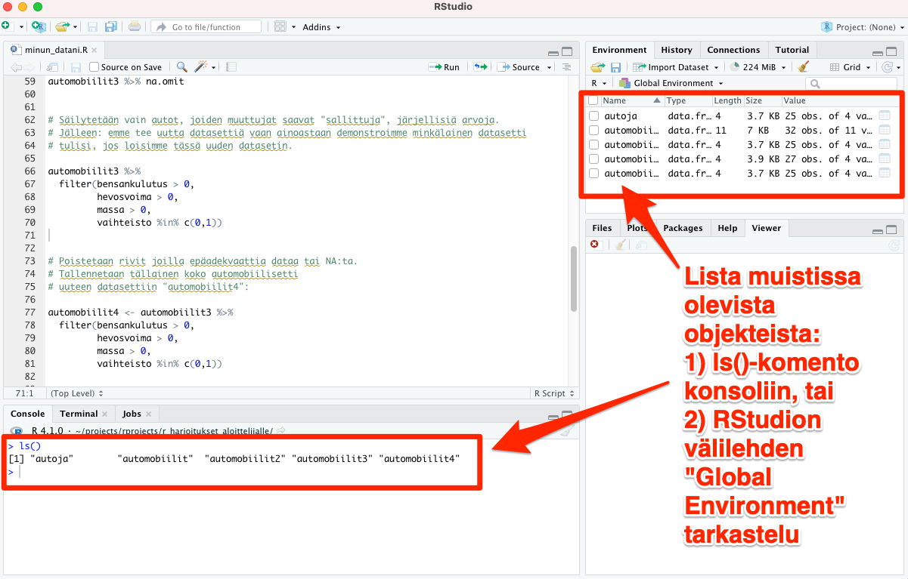

# Datasettien tuhoaminen

Kun kirjoitat konsoliin ``` ls() ```, näet kaikki R:n muistiin tallentamat datasetit - tai R:n tapauksessa puhutaan paremminkin objekteista.

Listaus näyttää suurinpiirtein seuraavalta:

```
[1] "automobiilit"  "automobiilit2" "automobiilit3" "automobiilit4"
```

<br>
Vaihtoehtoisesti voit tarkastella listausta objekteista RStudion tietyssä välilehdessä, katso kuva alla:



<br>


Tuhotaan harjoituksen vuoksi kaikki muut paitsi datasetti "automobiilit" seuraavalla käskyllä, jonka voit kirjoittaa vaikka suoraan konsoliin:

``` rm(automobiilit2, automobiilit3, automobiilit4) ```

Kun ajat uudelleen käskyn ``` ls() ``` konsolissa, näet vain datasetin "automobiilit":

``` 
[1] "automobiilit"
``` 

<br>

*Good to know: käsky ``` rm(list = ls()) ``` tuhoaa kaikki objektit R-session muistista (putsaa koko session tyhjäksi).*

*Good to know II: osa kokeneista R:n käyttäjistä ei tuhoa mitään koskaan, mutta resetoi silloin tällöin R:n ja aloittaa puhtaalta pöydältä. Tämä tapahtuu valitsemalla RStudion ylävalikosta "Session" -> "Restart R"*

<br>
<p xmlns:cc="http://creativecommons.org/ns#" xmlns:dct="http://purl.org/dc/terms/"><a property="dct:title" rel="cc:attributionURL" href="https://vldesign.kapsi.fi/r/">R-opas</a> by <a rel="cc:attributionURL dct:creator" property="cc:attributionName" href="http://www.linkedin.com/in/ville-langen">Ville Langén</a> is licensed under <a href="http://creativecommons.org/licenses/by-sa/4.0/?ref=chooser-v1" target="_blank" rel="license noopener noreferrer" style="display:inline-block;">Attribution-ShareAlike 4.0 International</a></p>
