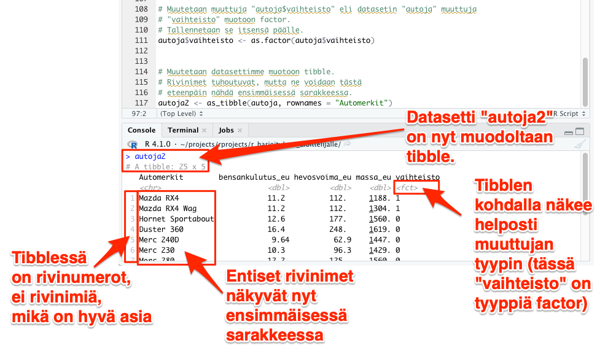

# Kategoriset muuttujat

Esimerkiksi bensankulutusta (tai tutkimuspotilaan pituutta) jatkuvalla asteikolla kuvaava muuttuja on jatkuva muuttuja. Sen sijaan edellä kappaleessa 9 esiteltiin hypoteettinen muuttuja *verenpainetauti*, joka sai joko arvon ```0``` tai ```1```; tällainen muuttuja ei olisi jatkuva vaan kategorinen muuttuja. Vielä spesifisemmin tällaisia dikotomisia (useimmiten joko arvon ```0``` tai ```1``` saavia) muuttujia kutsutaan ***dummy-muuttujiksi***.

On mielestäni viisasta kertoa R:lle, mitkä muuttujistasi ovat kategorisia muuttujia, jotta R ei erehdy käsittelemään niitä missään analyyseissä jatkuvina muuttujina. R:ssä kategoriset muuttujat kannattaa tallentaa *factor*-tyyppisenä. Tämä on erittäin helppoa.

Voit katsella dataasi kirjoittamalla *Consoleen* seuraavan käskyn:

```
autoja
```

<br>

Pikainenkin silmäys tulosteeseen (vain 4 riviä tässä alla) paljastaa sinulle, että muuttuja *vaihteisto* on tässä datassa tarkoitettu kategoriseksi muuttujaksi. Muut muuttujat taas ovat selvästi jatkuvia muuttujia.


```{r kategorinen_muuttuja, echo=FALSE}

head(autoja, n=4)

```

<br>

## as.factor-käsky

Muutetaan muuttuja *vaihteisto* muotoon *factor* eli kategoriseksi muuttujaksi ja tallennetaan tulos "itsensä päälle" eikä siis luoda uutta datasettiä vaikkapa nimellä "autoja2". Tähän on pari helppoa tapaa.

1. vaihtoehto: Base-R:llä tehtäisiin seuraavasti:

```
autoja$vaihteisto <- as.factor(autoja$vaihteisto)
```

Huomaa, että dollarimerkillä varustetulla ilmaisulla ```autoja$vaihteisto``` ilmoitamme, että tahdomme muuttaa datasetistä *autoja* ainoastaan muuttujan *vaihteisto* muotoon *factor*. 

2. vaihtoehto on tehdä sama asia *dplyr*ia hyödyntäen:

```
autoja <- autoja %>% mutate(vaihteisto = as.factor(vaihteisto))
```

Aja jompi kumpi yllä mainituista tavoista. Jos nyt katselet dataasi uudelleen kirjoittamalla *Consoleen* seuraavan käskyn, mitään eroa entiseen ei kuitenkaan näe (tässä näytettynä vain 4 riviä):

```
autoja
```


```{r kategorinen_muuttuja2, echo=FALSE}

head(autoja, n=4)

```


<br>

Onkin  ongelmallista, ettet näe kyseisessä tulosteessa, että tietääkö R kunkin muuttujan kohdalla että onko kyseessä jatkuva vaiko kategorinen muuttuja.

Apuun tulee *tibble*, joka on paranneltu versio karvalakki-R:n "datakehyksestä" (aiemmissa esimerkeissä "automobiilit", "automobiilit2" jne. olivat tässä karvalakkimuodossa). Sinun ei tässä vaiheessa tarvitse ymmärtää mitään datakehyksistä tai miksi *tibble* on parempi muoto - just take my word for it.

## tibble

Muutetaan seuraavassa datasettimme "autoja" muotoon *tibble*. Tallennetaan uusi datasetti nimellä "autoja2".

Teemme samalla toisen tärkeän korjauksen. Tähän mennessä datasettimme rivit on nimetty automerkkien mukaan, mutta rivien nimeäminen ylipäänsä ei ole tänä päivänä suositeltavaa. **Kun siirrymme *tibble*-muotoon, rivinimet tuhoutuvat ja tilalle tulevat rivinumerot**. Automerkit (tai analogisesti: "tutkittavien kooditunnisteet") näkyvät seuraavan käskyn jälkeen ensimmäisessä sarakkeessa, mikä on suositellumpaa.

Se käy näin - ja huomaa, että käsky on ```as_tibble``` eikä ```as.tibble```:

```
autoja2 <- as_tibble(autoja, rownames = "Automerkit")

```

<br>

Kun tämän jälkeen kirjoitat konsoliin seuraavan käskyn, voit helposti havaita, että R todella tietää, että muuttuja *vaihteisto* on kategorinen (eli R:n muodossa *factor*):


```
autoja2
```

<br>
Alla näkyy 4 riviä datasta (katso myös kuva alla):


```{r kategorinen_muuttuja3, echo=FALSE}

head(autoja2, n=4)

```

<br>



<br>
<p xmlns:cc="http://creativecommons.org/ns#" xmlns:dct="http://purl.org/dc/terms/"><a property="dct:title" rel="cc:attributionURL" href="https://vldesign.kapsi.fi/r/">R-opas</a> by <a rel="cc:attributionURL dct:creator" property="cc:attributionName" href="http://www.linkedin.com/in/ville-langen">Ville Langén</a> is licensed under <a href="http://creativecommons.org/licenses/by-sa/4.0/?ref=chooser-v1" target="_blank" rel="license noopener noreferrer" style="display:inline-block;">Attribution-ShareAlike 4.0 International</a></p>