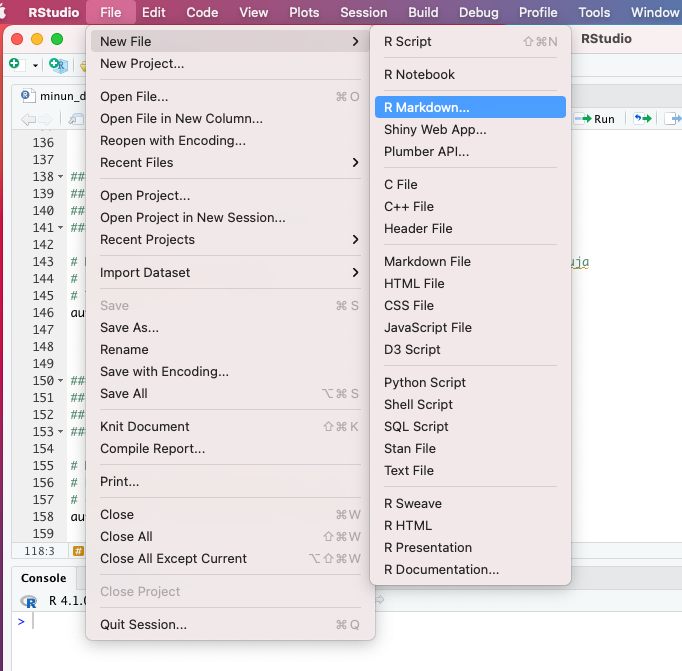
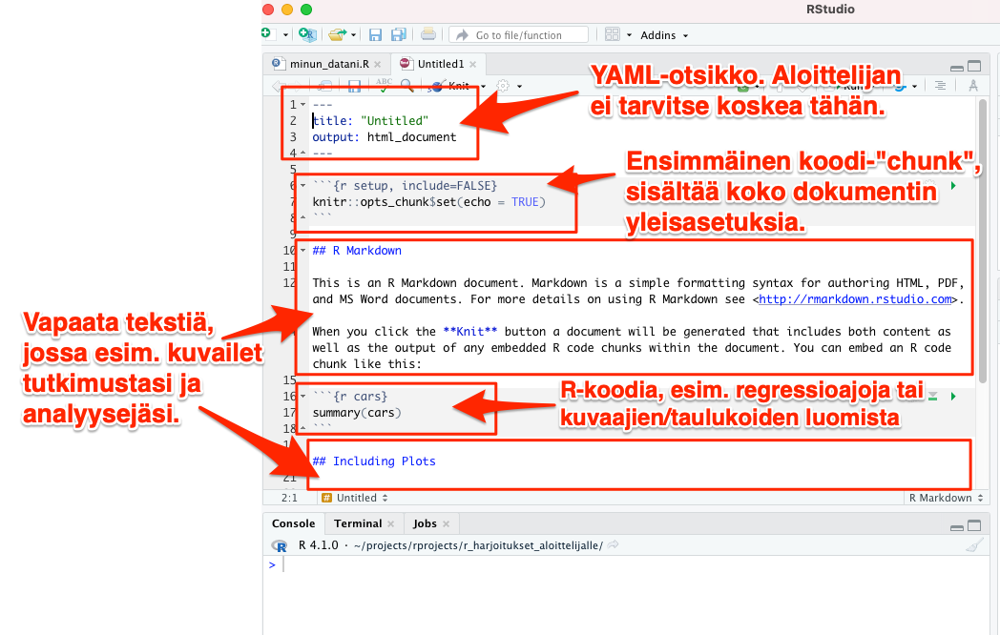
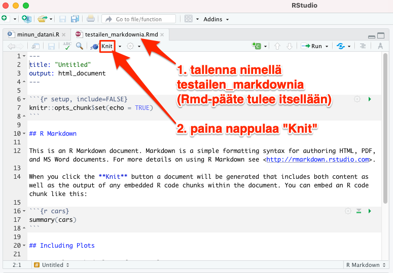
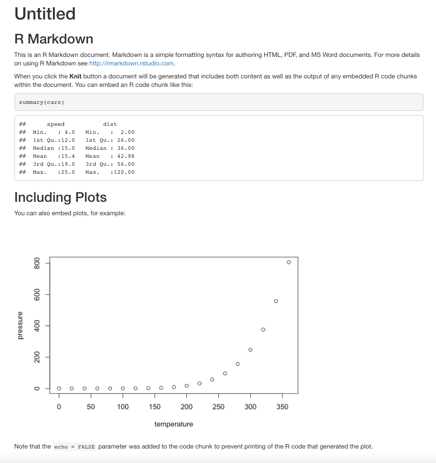

# R Markdownin luonti

Luo **R Markdown -tiedosto (tiedostopääte .Rmd)** valitsemalla RStudion valikosta *File --> New File --> R Markdown* (katso kuva alla).


<br>

Seuraavaksi tulee valikko, josta voit valita, oletko työstämässä loppupeleissä verkkosivua (eli HTML-muotoista tiedostoa), PDF:ää vaiko Word-tiedostoa. Ohjelma ehdottaa sinulle HTML-tyyppistä julkaisua - hyväksy tämä ehdotus valitsemalla *OK*.

>[](images/newmarkdown2.png)


<br>

Täten tulee luoduksi uusi .Rmd-tiedosto, jonka osiot ovat seuraavat (katso myös kuva alla):

1. YAML-otsikko aivan dokumenttisi alussa: sisältää asetuksia kuten valitsemasti työstettävän loppumuodon (HTML- vs. PDF- vs. Word-tiedosto)
2. Markdown-tyyppinen vapaa tekstisi (esim. juuri nyt lukemasi tekstin olen sellaisella kirjoittanut)
3. Erityiset koodi-"chunkit", jotka voivat sisältää R:n ja muutamien muidenkin ohjelmointikielien koodia





## Kääntö lopputuotokseksi

RStudio loi sinulle R Markdown -tiedoston sabluunan, jossa on jo jonkin verran sisältöä. Voit samantien kääntää dokumentin valmiiksi lopputuotokseksi. Tee seuraavasti:

1. Tallenna ensin tiedostosi valitsemalla *File --> Save as...* ja antamalla nimeksi esim: *testailen_rmarkdownia.Rmd*
2. Paina sitten painiketta "Knit" tekstisi yläpuolella (katso kuva alla)


<br>
<br>

Tällöin RStudion oma web-selain avautuu, ja näet juuri kääntämäsi R Markdown -dokumentin lopputuloksen HTML-muodossa (eli ikään kuin "web-sivuina"). Jos kaikki meni ok, näet alla olevan näkymän:




## YAML-otsikko

YAML-otsikko on eristetty muusta dokumentista kahden ```---```-tyyppisen viivarivin väliin. Jos olet aloittelija, sinun ei tarvitse koskea YAML-osioon ollenkaan. Voit aloittaa R Markdownin käytön suoraan sillä YAML-otsikolla, jonka RStudio sinulle loi, kun valitsit RStudion valikosta *File --> New File --> R Markdown*.

Jos kuitenkin olet innostunut kokeilemaan YAML:nkin säätöä, voit perehtyä online-ohjeisiin esim. kirjassa [R Markdown: The Definitive Guide.](https://bookdown.org/yihui/rmarkdown/html-document.html)

Saat helposti kyseisen sivun ohjeiden kanssa lisättyä dokumenttiisi esim. nimesi ja päivämäärän.

## R Markdownilla kirjoittaminen

Itse R Markdown -koodi on pitkälti ihan tavallista tekstiä - aivan kuin kirjoittaisi Wordilla, Notepadilla jne. **Lihavoidun tekstin** saat aikaiseksi laittamalla tekstikohdan ympärille kaksi asteriskia: ```**Lihavoidun tekstin**```. *Kursivoidun tekstin* saat aikaiseksi laittamalla vain yhden asteriskin kummallekin puolelle tekstiä: ```*Kursivoidun tekstin*```.

## "Chunkit"

Chunkeissa ajetaan analyysejä, tehdään taulukoita ja piirretään kuvia R-koodilla. Jokaisella chunkilla pitää olla oma yksilöllinen otsikkonsa, jonka keksit päästä; jos käytät kahdessa eri chunkissa samaa otsikkoa, R heittää sinulle herjan kun yrität kääntää dokumenttia nappulalla "Knit".

Chunkit erotellaan vapaasta tekstistä - siis markdown-osiosta - kirjoittamalla kolme gravisaksenttia sekä ennen että jälkeen koodin. [Gravisaksentti](https://fi.wikipedia.org/wiki/Gravis) on erityisen tuttu ranskaa lukeneille. Jos et tiedä, miten näppäimistöstä saa gravisaksentteja ulos, voit aina copy-pastettaa niitä vaikkapa tästä pikaoppaasta, jota olet lukemassa.

Alla esimerkki toimivasta chunkista: 


````markdown
`r ''````{r bensankulutus, echo=FALSE}
plot(autoja2$hevosvoima, autoja2$bensankulutus)
```
````

Kun mukana on yllä näkyvä ```echo=FALSE```, nähdään käskyn ```plot(autoja2$hevosvoima, autoja2$bensankulutus)``` aikaansaama tuloste mutta ei itse koodia ```plot(autoja2$hevosvoima, autoja2$bensankulutus)```, kun R Markdown -dokumenttimme käännetään lopputuotokseksi.

Tarkempia tietoja siitä, miten säätelet optiolla ```echo``` sitä mitä lopputuotoksessa näkyy, voit halutessasi katsoa [täältä.](https://rmarkdown.rstudio.com/lesson-3.html)

## Ensimmäinen chunk

Ensimmäinen chunk on erityinen: sen nimen tulee olla "r setup". Tässä ensimmäisessä chunkissa säädät asetuksia, jotka koskevat kaikkia myöhemmin chunkeja. Lisäksi tässä voit ladata source- eli lähdetiedoston, josta äskettäin säätämäsi datasetti "autoja2" löytyy.

Tee seuraavat muokkaukset ensimmäiseen chunkiin:

1. Kutsu *dplyr*-paketti library-komennolla
2. Lisää *minun_datani.R* ensimmäiseen chunkiin

Ensimmäisen chunkin pitäisi näyttää seuraavalta:


````markdown
`r ''````{r setup, include=FALSE}
knitr::opts_chunk$set(echo = TRUE)
library(dplyr)
source("minun_datani.R")
```
````

<br>
<p xmlns:cc="http://creativecommons.org/ns#" xmlns:dct="http://purl.org/dc/terms/"><a property="dct:title" rel="cc:attributionURL" href="https://vldesign.kapsi.fi/r/">R-opas</a> by <a rel="cc:attributionURL dct:creator" property="cc:attributionName" href="http://www.linkedin.com/in/ville-langen">Ville Langén</a> is licensed under <a href="http://creativecommons.org/licenses/by-sa/4.0/?ref=chooser-v1" target="_blank" rel="license noopener noreferrer" style="display:inline-block;">Attribution-ShareAlike 4.0 International</a></p>
