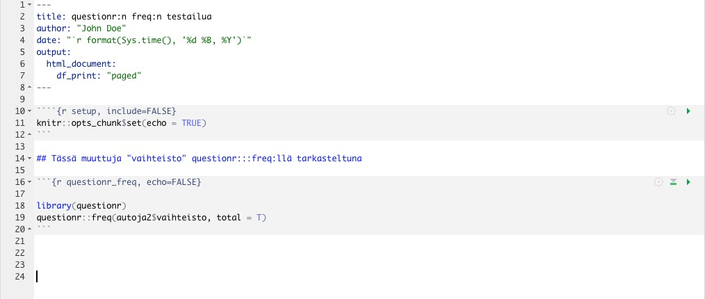
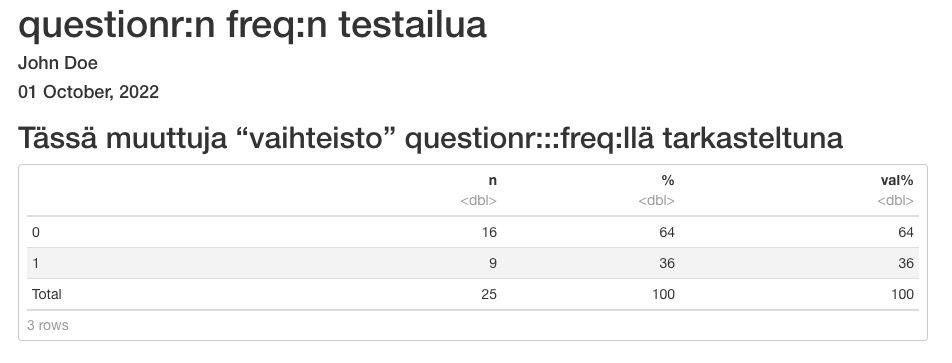

# Analyysejä R Markdownilla

Voit nyt alkaa analysoida dataasi "autoja2" R Markdown -dokumentissasi. Voit halutessasi tuhota RStudion sabluunasta tekstiä ja chunkeja tai kirjoittaa niiden päälle. Varo kuitenkin sotkemasta YAML-otsikkoa tai ensimmäistä "r setup" -chunkia.

## Datasetin tarkastelu

### head-komento


Hyödynnämme erittäin hyödyllistä komentoa *head*, joka tulostaa ensimmäiset 6 riviä datastamme. Saamme luotua pikasilmäyksen dataamme ja halutessamme jaettua sen R Markdownin muodossa eteenpäin.

Voit esim. kirjoittaa "Tässä muutaman rivin ote valmiista datastamme tässä artikkelissa". Sen jälkeen voit lyödä enterillä pari tyhjää riviä ja kirjoittaa seuraavan chunkin, jossa pitää siis olla gravisaksentteja 3 kpl alussa ja lopussa:


````markdown
`r ''````{r head_datastamme, echo=FALSE}

head(autoja2)
```
````

<br>
Tässä muutaman rivin ote valmiista datastamme tässä artikkelissa.


```{r head_datastamme, echo=FALSE}

head(autoja2)

```

<br>

Vaikka *tibble* on näppärä monella tapaa, henkilökohtaisesti en pidä tavasta, jolla *tibble*-tyyppisten datasettien desimaalipaikat tulostuvat. Apuun tässä (ja monessa muussa yhteydessä) tulostusjäljen kaunistamiseksi tulee komento *kable*, josta seuraavaksi.


### kable kaunistaa


Jotta tuloste olisi nätimpää katsella, lisätään vielä komento *kable*, joka tulee paketin *knitr* mukana. Voit asentaa kyseisen paketin antamalla konsoliin seuraavan käskyn:

```
install.packages("knitr")
```

<br>

Tämän lisäksi sinun kannattaa kutsua *knitr* käyttöön lisäämällä se ensimmäiseen, *r setup* -nimiseen chunkiin. Tämän jälkeen ensimmäinen chunkisi näyttää seuraavalta:


````markdown
`r ''````{r setup, include=FALSE}
knitr::opts_chunk$set(echo = TRUE)
library(dplyr)
library(knitr)
source("minun_datani.R")
```
````

<br>

Tämän jälkeen pääset käyttämään *kable*-komentoa.

Putkitetaan kaikki komennot seuraavasti:

````markdown
`r ''````{r head_datastamme_kable, echo=FALSE}

autoja2 %>% head %>% kable
```
````

<br>

Näet nyt kauniimman tulosteen:

```{r head_datastamme_kable, echo=FALSE}

autoja2 %>% head %>% kable


```


### tail-komento


Komento *tail* tekee saman kuin *head* mutta toisesta suunnasta eli näyttää datasetin 6 viimeistä riviä.


````markdown
`r ''````{r tail_datastamme_kable, echo=FALSE}

autoja2 %>% tail %>% kable
```
````


```{r tail_datastamme_kable, echo=FALSE}

autoja2 %>% tail %>% kable


```


## Muuttujien tarkastelu

### min, max, mean

*dplyr*:in käskyllä ```summarise``` voimme helposti katsoa esim. minimi- ja maksimiarvot sekä keskiarvot haluamistamme muuttujista:


````markdown
`r ''````{r keskiarvoja, echo=FALSE}


# Valitaan datasettimme "autoja2" käsittelyyn:

autoja2 %>%

# Käytetään summarise-käskyä:

      summarise(bensankulutuksen_minimi      = min(bensankulutus_eu),
                bensankulutuksen_maksimi     = max(bensankulutus_eu),
                bensankulutuksen_keskiarvo   = mean(bensankulutus_eu))  %>% 
           
# Kaunistetaan jälki kablella:           
           
      kable
```
```` 


```{r keskiarvoja, echo=FALSE}

# Valitaan datasettimme "autoja2" käsittelyyn:

autoja2 %>%

# Käytetään summarise-käskyä:

      summarise(bensankulutuksen_minimi      = min(bensankulutus_eu),
                bensankulutuksen_maksimi     = max(bensankulutus_eu),
                bensankulutuksen_keskiarvo   = mean(bensankulutus_eu))  %>% 
           
# Kaunistetaan jälki kablella:           
           
      kable


```
 
<br>

Voit myös tulostaa tietyn tunnusluvun - vaikkapa keskiarvon - useammalle muuttujalle käyttämällä komentoa ```summarise_at```. Kannattaa kirjoittaa ennen seuraavaa koodia vielä vapaata tekstiä, esim.

Alla näkyy datasetin "autoja2" muuttujien keskiarvoja.


````markdown
`r ''````{r keskiarvoja2, echo=FALSE}


# Valitaan datasettimme "autoja2" käsittelyyn

autoja2 %>%

# Käytetään käskyä summarise at. Halutut muuttujat täytyy
# ilmaista rotlassa seuraavasti:
# c("muuttuja1", "muuttuja2", "muuttuja3")
# Näiden jälkeen tulee vielä haluttu tunnusluku, seuraavassa valittiin mean

  summarise_at(c("bensankulutus_eu", "hevosvoima_eu", "massa_eu"), mean) %>% 

# Kaunistetaan jälki kablella

  kable
```
```` 

<br>

Alla näkyy datasetin "autoja2" muuttujien keskiarvoja.


```{r keskiarvoja2, echo=FALSE}

# Valitaan datasettimme "autoja2" käsittelyyn

autoja2 %>%

# Käytetään käskyä summarise at. Halutut muuttujat täytyy
# ilmaista rotlassa seuraavasti:
# c("muuttuja1", "muuttuja2", "muuttuja3")
# Näiden jälkeen tulee vielä haluttu tunnusluku, seuraavassa valittiin mean

  summarise_at(c("bensankulutus_eu", "hevosvoima_eu", "massa_eu"), mean) %>% 

# Kaunistetaan jälki kablella

  kable


```

<br>

Tästä analyysistä käy ilmi, että datasetin "autot2" sisältämät autot ovat kohtalaisia bensasyöppöjä.


### summary

Funktiolla *summary()* saat yhteenvedon koko datasetistäsi.


````markdown
`r ''````{r summary, echo=FALSE}

autoja2 %>% summary %>% kable()
```
````


```{r summary, echo=FALSE}

autoja2 %>% summary %>% kable()

```

<br>

Halutessasi voit ajaa komennon *summary* myös jokaiselle datasettisi muuttujalle erikseen, kun "looppaat" *summary*n *sapply*-nimisen komennon läpi. Tällöin et voi kuitenkaan käyttää *kable*a, joten jälki on rujompaa.


````markdown
`r ''````{r sapply2, echo=FALSE}

autoja2 %>% sapply(summary)
```
````


```{r sapply2, echo=FALSE}

autoja2 %>% sapply(summary)

```

<br>

R:lle on useita paketteja, joiden avulla saa kauniimpaa ja monipuolisempaa kuvailua datasetistäsi kuin mihin *summary*-komento pystyy. Seuraavaksi esitellään eräs tällainen.


### summarytools

*summarytools*-paketin funktioilla saa kauniita ja monipuolisia esityksiä datasetistäsi. 
Asentaminen tapahtuu siten, että kirjoitat konsoliin ```install.packages("summarytools")``` ja painat enteriä.

#### dfSummary

*dfSummary* antaa hyvin monipuolisen esityksen koko datasetistäsi. Katso alla esimerkkiä datasetistämme "autoja2". Aja seuraava koodi:


````markdown
`r ''````{r summarytools2, echo=FALSE, results="asis"}

# summarytools vaatii ylle määreen results="asis" jotta jälki näyttää
# R Markdownissa kauniilta.

library(summarytools)

autoja2 %>% dfSummary(varnumbers   = FALSE,
                      plain.ascii = FALSE,
                      style = "grid",
                      graph.magnif = 0.75,
                      max.distinct.values = 3,  # Laitoin tähän 3, jotta ei
                                                # lähde listaamaan automerkkejä
                                                # rivikaupalla.
                      valid.col    = FALSE,
                      tmp.img.dir  = "/tmp")
```
````

<br>
Näet tämän jälkeen seuraavan yhteenvedon:


```{r summarytools2, echo=FALSE, results="asis"}

# summarytools vaatii ylle määreen results="asis" jotta jälki näyttää
# R Markdownissa kauniilta.

library(summarytools)

autoja2 %>% dfSummary(varnumbers   = FALSE,
                      plain.ascii = FALSE,
                      style = "grid",
                      graph.magnif = 0.75,
                      max.distinct.values = 3,  # Laitoin tähän 3, jotta ei
                                                # lähde listaamaan automerkkejä
                                                # rivikaupalla.
                      valid.col    = FALSE,
                      headings = FALSE,
                      tmp.img.dir  = "/tmp")

```
 
<br>

#### descr

*summarytools*-paketin funktio *descr* ottaa datasetistä vain jatkuvat (numeeriset) muuttujat käsittelyyn, ja näyttää niistä erilaisia tunnuslukuja käyttäjän toiveita noudattaen. Tarkastele seuraavia esimerkkejä. 

Ensimmäinen esimerkki:


````markdown
`r ''````{r descr, echo=FALSE, results="asis"}

library(summarytools)

descr(autoja2,
      stats     = "common",
      transpose = TRUE,
      headings  = FALSE)
```
````

<br>
Pyysimme "common" tunnuslukuja - näet tähän alle tulostuneesta taulukosta mitä ne *descr*-komennon mielestä ovat.

Huomaa, että R heittää taulukon yläpuolelle herjan, että vain numeeriset muuttujat pääsivät analyysiin, mikä oli tiedossa:


```{r descr, echo=FALSE, results="asis"}

library(summarytools)

descr(autoja2,
      stats     = "common",
      transpose = TRUE,
      headings  = FALSE)

```
 
 
<br>
<br>

Toisessa esimerkissä määrittelemme itse haluamamme tunnusluvut:

````markdown
`r ''````{r descr2, echo=FALSE, results="asis"}

library(summarytools)
descr(autoja2,
      stats     = c("mean","sd","min","max"),
      transpose = TRUE,
      headings  = FALSE)
```
````


```{r descr2, echo=FALSE, results="asis"}

library(summarytools)
descr(autoja2,
      stats     = c("mean","sd","min","max"),
      transpose = TRUE,
      headings  = FALSE)

```
 

<br>
<br>

Kirjoittamalla konsoliin ```?descr```saat tietää tarkemmin, mitä kaikkia tunnuslukuja (*Help*in kohta "stats") voit funktiolta *descr* pyytää.

<br>

#### freq

*summarytools*-paketin funktiolla *freq* tutkitaan kategoristen muuttujien ominaisuuksia: n-lukuja, prosentuaalisia osuuksia ja kategorioiden kumulatiivista frekvenssiä.

Olen säätänyt alla olevaan esimerkkikoodiin asetukset siten, että tämä funktio olisi mahdollisimman paljon SASin loistavan PROC FREQin kaltainen.


````markdown
`r ''````{r freq, echo=FALSE, results="asis"}

library(summarytools)

st_options(freq.cumul = TRUE,
     freq.totals 	= TRUE,
     freq.report.nas 	= FALSE,
     plain.ascii = FALSE,
     headings = FALSE)

freq(autoja2$vaihteisto,
     style = 'rmarkdown',
     caption = 'Frequencies: autoja2$vaihteisto')


```
````

<br>

Tarkastelemme yllä näkyvän koodin kanssa datasetin "autoja2" kategorisen muuttujan "vaihteisto" kategorioiden (0 ja 1) tunnuslukuja. Otin yksistään tämän kirjan lukujen numerointiin liittyvistä "painoteknisistä" syistä otsikot pois; samasta syystä lisäsin käsin otsikon (caption-tekstin). Taulukko näkyy tässä alla:

<br>

```{r freq, echo=FALSE, results="asis"}

library(summarytools)

st_options(freq.cumul = TRUE,
     freq.totals 	= TRUE,
     freq.report.nas 	= FALSE,
     plain.ascii = FALSE,
     headings = FALSE)

freq(autoja2$vaihteisto,
     style = 'rmarkdown',
     caption = 'Frequencies: autoja2$vaihteisto')


```
 
<br>


#### ctable

*summarytools*-paketin funktio *ctable* pystyy tekemään ristiintaulukointeja hieman samaan tapaan kuin SASin PROC FREQ.

Tätä harjoitusta varten teemme uuden kategorisen muuttujan "bensasyoppo":


````markdown
`r ''````{r ctable, echo=FALSE, results='asis'}

library(summarytools)

# Tehdään tätä demoa varten uusi muuttuja "bensasyoppo"

autoja2 %>% mutate(bensasyoppo = ifelse(bensankulutus_eu < 13.2, 0, 1)) -> autoja3

autoja3$bensasyoppo <- as.factor(autoja3$bensasyoppo)


ctable(x = autoja3$vaihteisto, 
       y = autoja3$bensasyoppo, 
       prop     = 'r',
       totals   = T, 
       headings = FALSE)


```
````


```{r ctable, echo=FALSE, results='asis'}

library(summarytools)

# Tehdään tätä demoa varten uusi muuttuja "bensasyoppo"

autoja2 %>% mutate(bensasyoppo = ifelse(bensankulutus_eu < 13.2, 0, 1)) -> autoja3

autoja3$bensasyoppo <- as.factor(autoja3$bensasyoppo)


ctable(x = autoja3$vaihteisto, 
       y = autoja3$bensasyoppo, 
       prop     = 'r',
       totals   = T, 
       headings = FALSE)


```
  
 
 
 


<br>

### questionr::freq

Olen nyttemmin käyttänyt *summarytools*-paketin funktion *freq* asemesta aika paljon *questionr*-paketin funktiota *freq*. Tästä on seuraavia etuja:

- Jos ajaa analyysin vain chunkissa (painaa play-nappulaa chunkin oikeassa ylälaidassa), analyysin tulos näkyy mukavassa, "ei-ASCIImaisessa" painoasussa chunkin alla.
- Jos YAML-osuuteen dokumentin alussa kirjoittaa HTLM-tiedoston muodoksi "paged", *questionr::freq*:n sama nätti asuu jatkuu vielä HTML-tiedostonkin puolella, kun on painanut nappia *Knit*.

Huonouksia:

- Käsiteltävän muuttujan nimi ei printtaannu minnekään
    - Tämän voi huomioida siten, että laittaa RMarkdownissa alaotsikkoon kyseisen muuttujan risuaitojen perään

Alla toimiva esimerkki YAML-osuuksineen.





<br>


### table1

Kannattaa harkita myös *table1*-paketin asentamista. Toinen yhtä hyvä vaihtoehto on paketti *tableone*. Näissä kummassakin tarkoituksena on, että hyvin yksinkertaisella käskyllä generoituisi mahdollisimman valmis "Table 1. Characteristics" -taulukko työstettävään artikkeliin.

Voit halutessasi asentaa *table1*-paketin antamalla seuraavan käskyn konsoliin:


```
install.packages("table1")
```

<br>

Tämän jälkeen voit kokeilla paketin toimintaa seuraavasti:


````markdown
`r ''````{r table1, echo=FALSE}

library(table1)

label(autoja2$bensankulutus_eu) <- "Polttoaineenkulutus"
label(autoja2$hevosvoima_eu) <- "Hevosvoima"
label(autoja2$massa_eu) <- "Massa"
label(autoja2$vaihteisto) <- "Vaihteisto"

units(autoja2$bensankulutus_eu) <- "l/100 km"
units(autoja2$massa_eu) <- "kg"

table1(~ bensankulutus_eu + hevosvoima_eu + massa_eu + factor(vaihteisto),
       caption = "Table 1. Characteristics",
       data=autoja2)
```
````

```{r table1, echo=FALSE}

library(table1)

label(autoja2$bensankulutus_eu) <- "Polttoaineenkulutus"
label(autoja2$hevosvoima_eu) <- "Hevosvoima"
label(autoja2$massa_eu) <- "Massa"
label(autoja2$vaihteisto) <- "Vaihteisto"

units(autoja2$bensankulutus_eu) <- "l/100 km"
units(autoja2$massa_eu) <- "kg"

table1(~ bensankulutus_eu + hevosvoima_eu + massa_eu + factor(vaihteisto),
       caption = "Table 1. Characteristics",
       data=autoja2)

```


## Kuvaajat

Voit helposti lisätä kuvaajia R Markdown -dokumenttiisi. Tarkastelemme seuraavaksi Base-R:n komentoa *plot* ja sen jälkeen monipuolista *ggplot*ia.


### plot

Komento *plot* kuuluu karvalakki-R:ään. Kokeile seuraavaa koodia:


````markdown
`r ''````{r bensankulutus, echo=FALSE}
plot(autoja2$hevosvoima_eu, autoja2$bensankulutus_eu)
```
````

```{r bensankulutus, echo=FALSE}
plot(autoja2$hevosvoima_eu, autoja2$bensankulutus_eu)
```

### ggplot2

Hiemankin monimutkaisemmissa kuvaajissa suosittelen, että harkitset paketin *ggplot2* asentamista antamalla konsolissa käskyn:


```
install.packages("ggplot2")
```

<br>

Tämän jälkeen voit tehdä uudelleen edellä jo esitetyn kuvaajan *ggplot2*:lla, ja voit esimerkiksi lisätä mukaan regressiosovitteen seuraavasti:


````markdown
`r ''````{r bensankulutus_ggplot2, echo=FALSE, message = FALSE}

# ggplot2 on jonkun verran "puhelias", joten lisäsin
# option message = FALSE ylle; voit toki kokeilla
# sen pois ottamista.


library(ggplot2)

ggplot(autoja2, aes(hevosvoima_eu, bensankulutus_eu)) +
  geom_point() +
  geom_smooth(method='lm')       # + theme_classic()

# voit ottaa yllä olevan risuaidan pois, jos tahdot klassisen teeman
```
````


```{r bensankulutus_ggplot2, echo=FALSE, message = FALSE}

# ggplot2 on jonkun verran "puhelias", joten lisäsin
# option message = FALSE ylle; voit toki kokeilla
# sen pois ottamista.


library(ggplot2)

ggplot(autoja2, aes(hevosvoima_eu, bensankulutus_eu)) +
  geom_point() +
  geom_smooth(method='lm')       # + theme_classic()

# voit ottaa yllä olevan risuaidan pois, jos tahdot klassisen teeman

```


<br>

Jos et pidä taustaväreistä tai ylipäänsä väreistä kuvaajassasi, näitä voi säätää loputtomiin helposti ja hyvinkin pikkutarkasti *ggplot2*:sta käytettäessä. Myös valmiita erilaisia teemoja on; voit halutessasi kokeilla miltä *theme_classic* näyttää poistamalla sen edestä risuaidan yltä esimerkkikoodista.


## Lineaarinen regressio

Tutkimme edellä hevosvoiman ja bensankulutuksen yhteyttä kuvaajilla. Voit tutkia samaa kysymyksenasettelua numeerisesti lineaarisella regressiolla.

### Yksinkertainen regressio

Aloitamme ns. yksinkertaisella lineaarisella regressiolla:

````markdown
`r ''````{r simppeliregressio, echo=FALSE}

# Jotta koodi toimii, vaaditaan kohta data = . mikä tarkoittaa sitä,
# että "putkesta" läpi tullut data otetaan regressiomalliin mukaan.

autoja2 %>%
          lm(bensankulutus_eu ~ hevosvoima_eu, data = .) %>%
          summary()
```
````


```{r simppeliregressio, echo=FALSE}

# Jotta koodi, toimii vaaditaan kohta data = . mikä tarkoittaa sitä,
# että "putkesta" läpi tullut data otetaan regressiomalliin mukaan.

autoja2 %>%
          lm(bensankulutus_eu ~ hevosvoima_eu, data = .) %>%
          summary()

```


Tarkastellaan yltä tuloksia. Kun tutkittiin hevosvoiman assosiaatiota bensankulutukseen, kulmakertoimeksi tuli 0.039096 ja P-arvoksi 8.91e-05 ***.

Hevosvoima näyttää siis olevan yhteydessä bensankulutukseen, ainakin yksinkertaisella lineaarisella regressiolla tutkittuna.

Jälki ruudulla vain on rujohkon näköistä karvalakki-R:n *summary*-komennolla tuotettuna. Avuksi tulee *tidy*, siitä lisää seuraavassa.

### tidy

Edellisessä kappaleessa ajoimme yksinkertaista lineaarista regressiota ja tarkastelimme tuloksia komennolla *summary*, jonka tuottama tuloste ruudulla ei kuitenkaan ole silmälle miellyttävää.

Asian korjaamiseksi voit harkita paketin *broom* asentamista. Kyseisen paketin mukana tulee komento *tidy*, jolla regressiomallin tuloksen saa jaettua kauniissa muodossa kun samaan putkeen vielä laitetaan *kable*.

Paketin *broom* voit asentaa ajamalla konsolissa seuraavan käskyn:

```
install.packages("broom")
```

<br>

Tämän jälkeen voit ajaa seuraavan koodin:


````markdown
`r ''````{r simppeliregressio_tidy, echo=FALSE}

# Huom. voit laittaa library(broom) -komennon myös suoraan r setup -chunkiisi,
# jolloin sitä ei tarvitse jatkuvasti toistella:

library(broom)


# Jotta koodi toimii, vaaditaan kohta data = . mikä tarkoittaa sitä,
# että "putkesta" läpi tullut data otetaan regressiomalliin mukaan.

autoja2 %>%
          lm(bensankulutus_eu ~ hevosvoima_eu, data = .) %>%
          tidy %>% 
          kable
```
````

<br>
Kuten alla näet, tidy ja kable tuottavat yhteistyönä kauniimpaa jälkeä eteenpäin jaettavaksi:


```{r simppeliregressio_tidy, echo=FALSE}

# Huom. voit laittaa library(broom) -komennon myös suoraan r setup -chunkiisi,
# jolloin sitä ei tarvitse jatkuvasti toistella:

library(broom)


# Jotta koodi, toimii vaaditaan kohta data = . mikä tarkoittaa sitä,
# että "putkesta" läpi tullut data otetaan regressiomalliin mukaan.

autoja2 %>%
          lm(bensankulutus_eu ~ hevosvoima_eu, data = .) %>%
          tidy %>% 
          kable
        
```


### Multippeli regressio

Jatketaan jo edellä esitellyllä lineaarisella mallilla, mutta lisätään vielä mukaan kovariaateiksi massa ja vaihteisto. Tällöin kyseessä on multippeli lineaarinen regressio.

````markdown
`r ''````{r multippeliregressio, echo=FALSE}

library(broom)

autoja2 %>%
          lm(bensankulutus_eu ~ hevosvoima_eu + massa_eu + vaihteisto, data = .) %>%
          tidy %>%
          kable
```
````


```{r multippeliregressio, echo=FALSE}

library(broom)

autoja2 %>%
          lm(bensankulutus_eu ~ hevosvoima_eu + massa_eu + vaihteisto, data = .) %>%
          tidy %>%
          kable
```

<br>

Hevosvoima näyttää olevan edelleen yhteydessä bensankulutukseen, ei kuitenkaan enää niin vahvasti. Massa näyttää olevan enemmänkin yhteydessä bensankulutukseen. Mielenkiintoista kyllä, vaihteisto ei näytä olevan yhteydessä bensankulutukseen.

<br>
<p xmlns:cc="http://creativecommons.org/ns#" xmlns:dct="http://purl.org/dc/terms/"><a property="dct:title" rel="cc:attributionURL" href="https://vldesign.kapsi.fi/r/">R-opas</a> by <a rel="cc:attributionURL dct:creator" property="cc:attributionName" href="http://www.linkedin.com/in/ville-langen">Ville Langén</a> is licensed under <a href="http://creativecommons.org/licenses/by-sa/4.0/?ref=chooser-v1" target="_blank" rel="license noopener noreferrer" style="display:inline-block;">Attribution-ShareAlike 4.0 International</a></p>

 