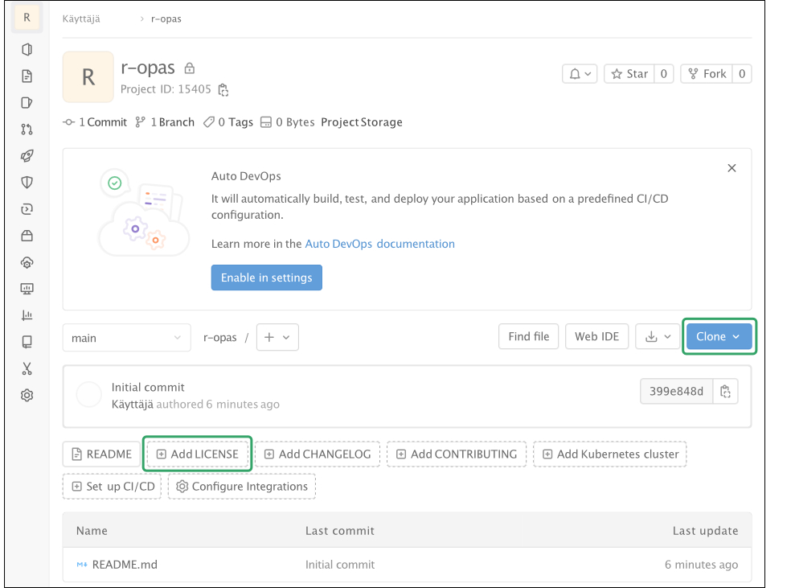
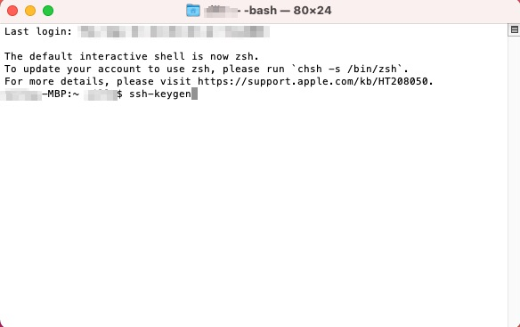
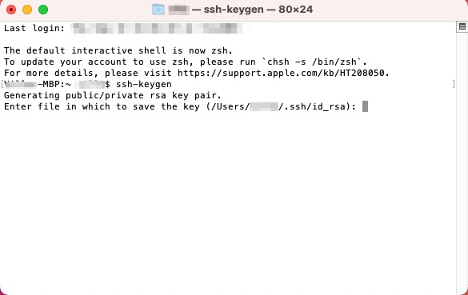
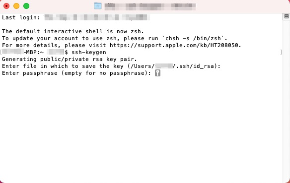
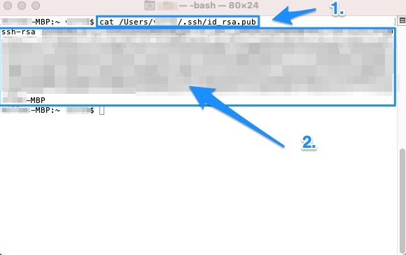
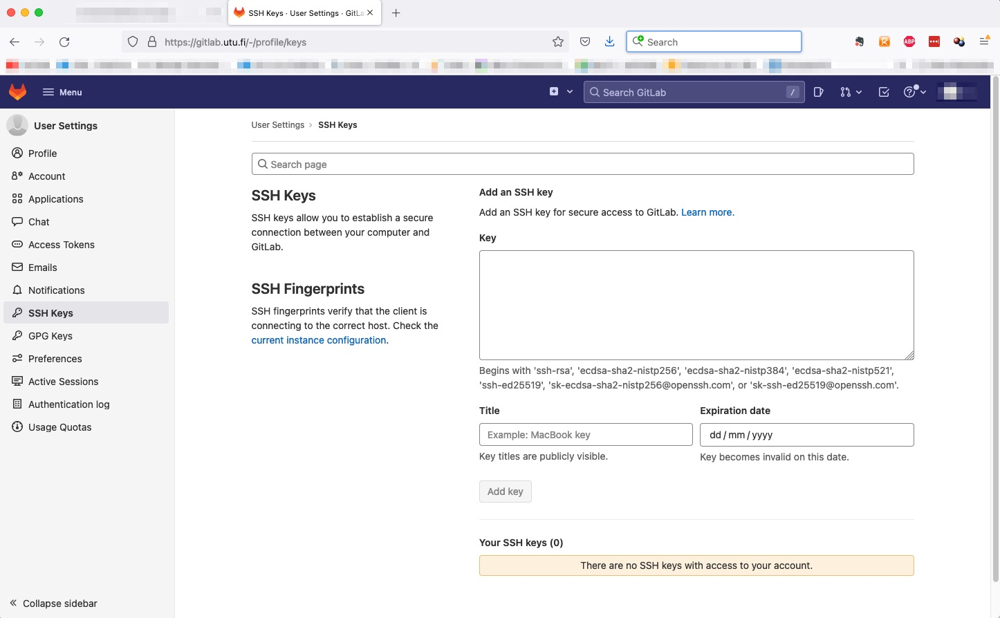
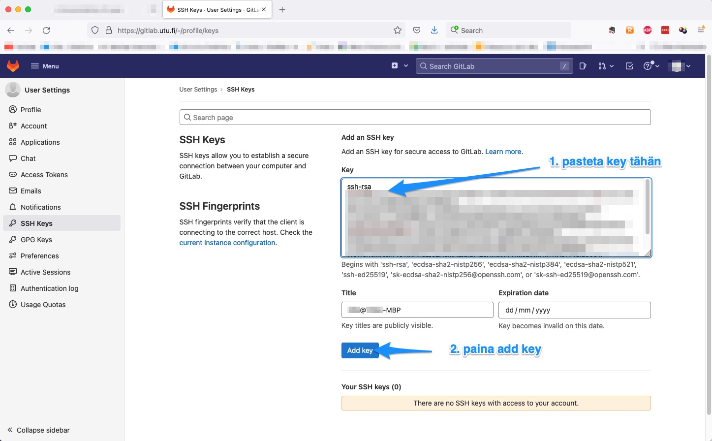
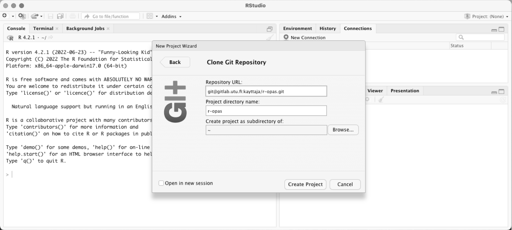
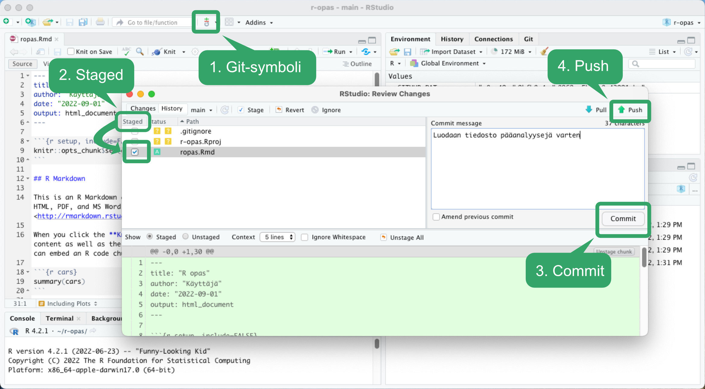

# (APPENDIX) Liitteet {.unnumbered}

# Versionhallinta

*Joonatan Palmu*

<br> <br> <br>

Versionhallinta on monikäsitteinen termi, joka kuvaa R-koodin
tallentamista työn edetessä erityiseen varastoon (*repository*), joka
tarjoaa mm. seuraavia etuja:

-   yhtä useampi henkilö voi osallistua projektiin
-   työ ei vahingossa tuhoudu
-   virheet on helpompi löytää kun vertaa toimivaa ja rikkinäistä
    versiota rinnakkain
-   versionhallinta on yksi mahdollisista keinoista tieteen
    [replikaatiokriisin](https://en.wikipedia.org/wiki/Replication_crisis)
    ratkomisessa

Yleisin ja luultavasti paras versionhallintaohjelmisto on tällä hetkellä
Git, jolle myös Turun yliopisto tarjoaa varastotilaa. Turun yliopistossa
kirjoilla olevat voivat kirjautua yliopiston palvelimeen osoitteessa
[gitlab.utu.fi](https://gitlab.utu.fi/). Yhtä hyviä vaihtoehtoja ovat
[GitHub](https://github.com) ja [GitLab](https://gitlab.com), jotka
eivät vaadi kirjoillaoloa missään oppilaitoksessa.

## Versionhallinta - ei vain guruille

Versionhallinta voi äkkiseltään näyttäytyä monimutkaisena käsitteenä,
jonka aloittelija mielellään jättäisi vain edistyneille koodaajille.
Olemme nostaneet aiheen esiin kuitenkin jo tässä R-pikaoppaassa, sillä
versionhallinnan käyttöön kannattaa totutella niin aikaisin kuin
mahdollista, jo yllä kuvatuista syistä. Tässä oppaassa esitellään alla
metodi, jolla saat vaivatta versionhallinnan arvokkaana työkaluna
projektiisi heti alusta alkaen.

## Avoimista lisensseistä

Jos ei ole erityistä syytä toimia toisin, on omaan R-koodiin aina hyvä
heti alussa liittää mukaan avoin lisenssi - ts. käyttölupa, joka
oikeuttaa muiden käyttää työtä haluamallaan tavalla (tekijän lisenssissä
osoittamin oikeuksin). Avoimista lisensseistä saa tietoa osoitteesta
[ChooseALicense.com](https://choosealicense.com). Kyseinen sivusto ohjaa
sopivan lisenssin valinnassa, on sitten kyse tietokoneella luodusta
ohjelmakoodista, videoista tai sekalaisia työn muotoja sisältävistä
projekteista.

Mainittakoon, että tälle R-oppaalle on luotu lisenssi [Creative
Commonsin palvelussa](https://creativecommons.org/choose/?lang=fi),
jossa [sopivan lisenssin saa muutamalla klikkauksella
valittua](https://creativecommons.org/choose/?lang=fi) avautuvista
valikoista. Creative Commonsin lisenssit soveltuvat erityisen hyvin
esim. kirjojen, valokuvien ja musiikin lisensoitiin.

Internetistä löytyy valtavasti esimerkkikoodia, jonka hyödyntämistä
vaikeuttaa valitettavan paljon lisenssitiedon puuttuminen. Tyypillisesti
tekijänoikeuden omistajaa ei enää ole mahdollista jälkikäteen tavoittaa
luvan kysymiseksi, eli pyörä joudutaan keksimään uudelleen. Tämä
epäkohta olisi helposti torjuttavissa, kun jokaiseen projektiin
liitettäisiin alusta asti selkeä lisenssi.

Omien analyysien uskottavuutta ja toistettavuutta lisää merkittävästi
artikkelin rinnalla julkaistu avoimesti lisensoitu analyysikoodi. Omasta
ohjelmakoodista voi tehdä helposti viitattavaa CERN:n
[Zenodo](https://zenodo.org)-palvelua käyttäen, jolloin esimerkiksi
koodit sisältävälle zip-tiedostolle (ladattavissa suoraan yliopiston
Git-palvelimelta) saa pysyvän arkistointipaikan ja DOI-tunnuksen.

Alla näkyvään taulukkoon on listattu muutamia keskeisimpiä
peruslisenssejä. Voit lukea lisää erilaisista avoimista lisensseistä
halutessasi
[Wikipediasta.](https://fi.wikipedia.org/wiki/Avoin_lisenssi)

<br> <br>

```{r lisenssit, tidy=FALSE, echo=FALSE, message=FALSE}
library(tidyverse)
tibble::tribble(
                
        
   ~"Avoimen lisenssin nimi", ~"Lisenssin kuvaus", ~"Huomioitavaa",
                                 
   "[MIT](https://choosealicense.com/licenses/mit/)", "Äärimmilleen typistetty yksinkertainen ja salliva peruslisenssi", "Soveltuu hyvin ohjelmointikoodin lisensointiin",
   
   "[CC-BY 4.0](https://creativecommons.org/licenses/by/4.0/deed.fi)", "Yksi Creative Commonsin lisensseistä: työ vapaasti muunneltavissa ja jaettavissa, mutta johdannaisen lähde on mainittava", "Ei sovellu hyvin ohjelmointikoodin lisensointiin",
   
   
   "[LGPLv3](https://choosealicense.com/licenses/lgpl-3.0/)", "Työ on vapaasti muunneltavissa, mutta myös julkaistun johdannaisen pitää olla avoin", "Soveltuu erinomaisesti ohjelmointikoodin lisensointiin"
   

  ) -> lisenssit_data

knitr::kable((lisenssit_data), booktabs = TRUE,
caption = 'Muutama valikoitu peruslisenssi')


```

<br> <br>

Saat haettua projektillesi lisenssin myös suoraan Gitlabissä sen
valmiilla malleilla (*template*) alla olevassa kuvassa esitettävällä
tavalla.

<br>

 <br>

## Varaston (*repository*) luominen yliopiston palvelimelle

-   Mene verkkoselaimellasi osoitteeseen
    [gitlab.utu.fi](https://gitlab.utu.fi)
-   Valitse oikealta ylhäältä `New project` -nappi
-   Luo uusi projekti painikkeesta `Create blank project`. Projektille
    kannattaa valita kuvaava nimi
-   Tässä vaiheessa näkyvyyden voi valita salatuksi (private), jos koodi
    julkistetaan vasta artikkelin julkaisun yhteydessä
-   Projektin luomisen jälkeen käyttäjälle aukeaa alhaalla olevan kuvan
    kaltainen näkymä, josta `Clone`-napin alta löytyy projektin
    SSH-osoite ja `Add LICENSE`-napin takaa voi projektille lisätä
    lisenssin valmiita malleja (*template*) käyttäen.



<br>

## SSH-avaimen luominen {#SSH-avain-miten-luodaan}

-   RStudion ja Git-palvelimen välinen tiedonsiirto edellyttää
    ssh-avaimen luomista

-   Linuxissa ja Mac:ssä tämä tapahtuu helposti antamalla terminaalissa
    komento `ssh-keygen`

-   Tämän jälkeen julkinen avain (`~/.ssh/id_rsa.pub`) pitää kopioida
    yliopiston palvelimelle osoitteessa
    <https://gitlab.utu.fi/-/profile/keys>

-   Avaimen luominen on mahdollista myös Windowsissa

    -   Jos windowsin shell ei tunnista `ssh`- tai `ssh-keygen`
        -komentoja, täytyy `Optional Features` -valikosta asentaa
        `OpenSSH Client`

-   Tarkemmat ohjeet Macille kuvineen alla:

Avaa Macissä Terminal (avautuu mm. seuraavasti: paina
Omppu+välilyöntinäppäin ja kirjoita *terminal* ja paina enteriä) ja
kirjoita Terminaliin `ssh-keygen` ja paina enteriä:



<br>


MacOS ehdottaa kohdetta, johon SSH-avain tallennetaan - voit hyväksyä
ehdotuksen:



<br>


MacOS kysyy salasanaa SSH-avaimelle; kun se nyt tulee käyttöön RStudion
ja gitlab.utu.fi:n välille, itse jättäisimme salasanan tässä asettamatta
painamalla pariin otteeseen pelkkää enteriä:



<br>


Tämän jälkeen MacOS näyttää, mihin SSH-avain on tallennettu:


<br>

Nyt voit kirjoittaa `cat /Users/sinunkäyttäjänimesi/.ssh/id_rsa.pub`, jolloin koko SSH-avain tulostuu näytölle, ja voit kopioida SSH-avaimen leikepöydälle (maalaa jo sanoista *ssh-rsa* ja lopussa aina Mac-koneesi tyyppiä myöden, tässä tapauksessa *-MBP*):




<br>

Voit nyt logata gitlab.utu.fi:hin ja klikata oikealle ylös omaan avatariisi, jonka alta valitaan Preferences, ja edelleen vasemmasta laidasta SSH Keys:




<br>

Tämän jälkeen SSH-avaimesi pastetetaan kohtaan Key leikepöydältä, jonne äsken SSH-avaimesi tallensit, ja klikataan Add key:



<br>

<br>

## Varaston käyttö RStudiossa

-   Valitse valikosta `File`, `New Project`, `Version Control` ja `Git`
    (alla kuva). Lisää tähän projektin internet-sivuilta `Clone`-napin
    alta kopioitu SSH-osoite

<br>



<br>

-   Kun projekti on tuotu paikalliselle koneelle, voi siihen lisätä
    analyyseissä tarvittavia tiedostoja valitsemalla `File New` ja
    `R markdown`

-   Uuden tiedoston lisäämisessä on kaksi vaihetta:

    (1) tiedoston siirtäminen versionhallintaan eli kommitointi
        (*commit*), ja
    (2) tehtyjen muutosten siirtäminen omalta koneelta palvelimelle eli
        pushaus

-   Aina kun on tehty merkittävä muutos, lisätään se versiohallintaan
    käyttäen alla olevassa kuvassa näkyviä nappeja `GIT`, `Staged`,
    `Commit` ja `Push`

<br>



<br>

-   Tiedoston siirtymisen yliopiston palvelimelle voi tarkistaa
    katsomalla projektin internetsivua selaimella
-   Kun tiedosto on kerran lisätty versiohallintaan, voi jatkossa sitä
    koskevat muutokset päivittää `Git`-napin takaa `Commit`-nappia
    painamalla. Kommitoidessa on hyvä tapa liittää kuvailu tehdyistä
    muutoksista. Tehdyt *commitit* pitää vielä siirtää yliopiston
    palvelimelle `Push`-napista.
-   Muutokset kannattaa kommitoida aina kun saa koodissa jonkin
    kokonaisuuden valmiiksi tai esimerkiksi virheen korjattua.
    Vaihtoehtoisesti tämän voi tehdä aina päivän päätteeksi.

## Yhteenveto

Kolme yksinkertaista keinoa parantaa merkittävästi omia analyysejä,
niiden toistettavuutta ja yhteistyömahdollisuuksia:

-   Käytä versionhallintaa (pieni investointi maksaa vaivan monin
    kerroin)

-   Lisää koodiin avoin lisenssi (myös oma näkyvyys lisääntyy, jos muut
    jakavat työtäsi)

-   Käytä R-kirjastojen hallinnoimiseen packrat- tai
    renv-pakettihallintaa (analyysit on mahdollista toistaa vielä yli
    6--12 kk:n kuluttua)

    -   Näiden käyttöä ei käsitellä tässä R-oppaassa, mutta renv
        esitellään hyvin havainnollistavasti [tässä
        YouTube-videossa](https://www.youtube.com/watch?v=yjlEbIDevOs)
        (jos olet kiireinen, kelaa suoraan videon kohtaan 10:20)

<br> <br>

<p xmlns:cc="http://creativecommons.org/ns#" xmlns:dct="http://purl.org/dc/terms/">

<a property="dct:title" rel="cc:attributionURL" href="https://vldesign.kapsi.fi/r/">R-opas</a>
by
<a rel="cc:attributionURL dct:creator" property="cc:attributionName" href="http://www.linkedin.com/in/ville-langen">Ville
Langén</a> is licensed under
<a href="http://creativecommons.org/licenses/by-sa/4.0/?ref=chooser-v1" target="_blank" rel="license noopener noreferrer" style="display:inline-block;">Attribution-ShareAlike
4.0
International</a>

</p>
