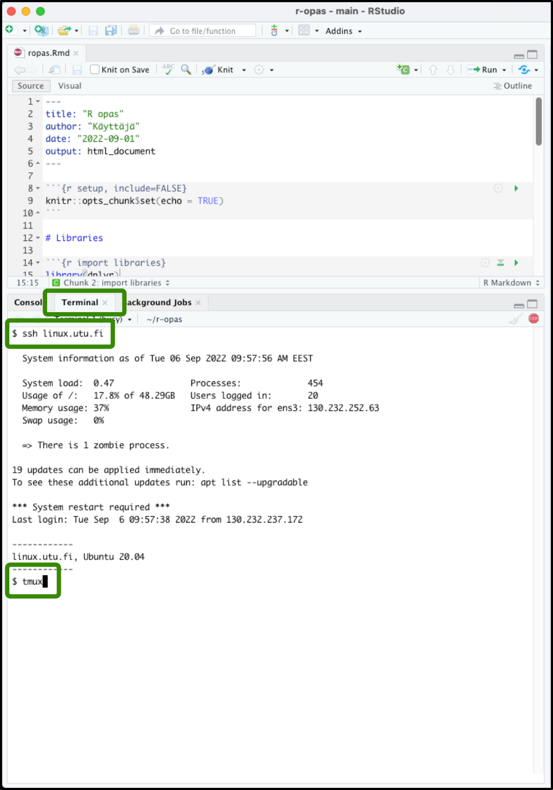
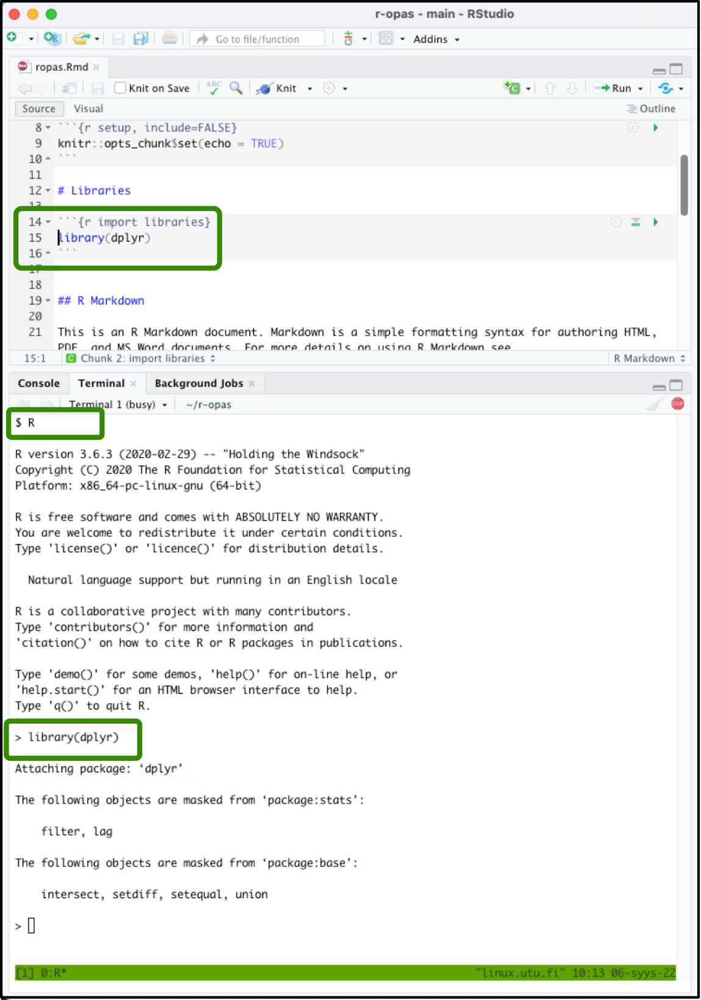
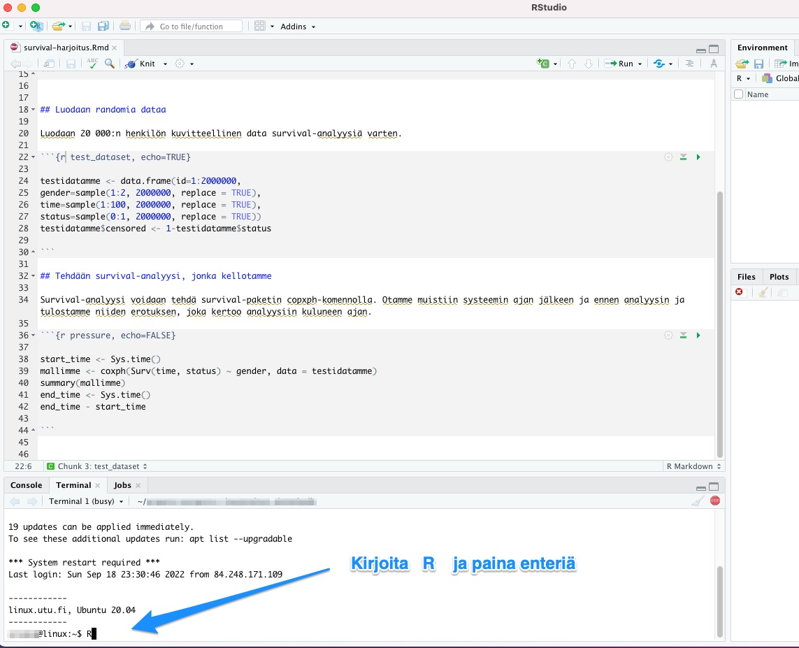
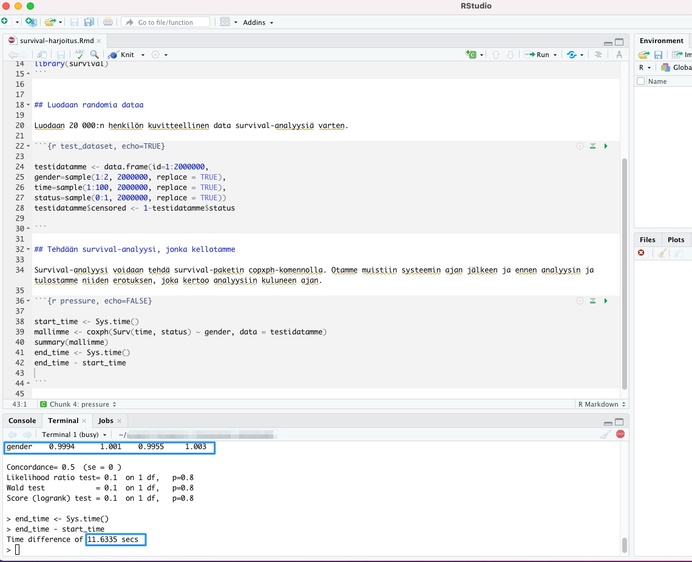

# RStudio ja SSH

*Joonatan Palmu*

<br> <br> <br>

Raskaammassa tieteellisessä laskennassa saattaa tulla tarpeelliseksi siirtyä tekemään analyysit oman kannettavan sijaan raskaalle [tietokoneklusterille](https://en.wikipedia.org/wiki/Computer_cluster). Tämä saattaa myös olla tarpeen, jos tutkittava aineiston saatavuutta on rajoitettu tiettyyn pilveen. Usein klusterit on toteutettu Linuxia käyttäen. Sujuvan tutkimustyön kannalta olisi kuitenkin analyysit hyödyllistä pystyä edelleen ajamaan interaktiivisesti RStudiossa omalla kannettavalla: käyttäjä siis kontrolloi prosesseja omalta kannettavaltaan, mutta järeämpi tietokoneklusteri toteuttaa ne. Tämä on usein mahdollista seuraavia ohjeita käyttäen.

## Rstudion terminaali

-   RStudiossa on `R console` -välilehden lisäksi `Terminal`-välilehti. Näiden kahden välilehden erona on, että RStudio avaa edeltävään R komentorivin ja jälkimmäiseen järjestelmän yleisen komentokehoitteen (engl. *shell),* joka on tässä tapauksessa yleensä nimeltään joko *bash* tai *zsh*. Yleisessä komentokehoitteessa voidaan suorittaa kaikenlaisia komentoja kuten esimerkiksi ajaa R-komentoriviä etäyhteyden yli(!).
-   Valitsemalla `Terminal`-välilehti, voidaan ssh-komennolla ottaa yhteys tietokoneklusteriin. Tässä esimerkissä käytämme Turun yliopiston Linux-serveriä.

## SSH-avaimet

-   SSH-avaimet ovat salasanaa parempi vaihtoehto tunnistautumiseen sekä käytännöllisyyden että turvallisuuden puolesta

    -   Oman ssh-avaimen olemassaolon voi varmistaa komennolla `ls ~/.ssh/id_rsa.pub`

    -   Tarvittaessa uusi ssh-avain on helppo luoda komennolla `ssh-keygen` oletusparametreja käyttäen (älä aseta salasanaa avaimelle)

        -   Edellä tämän oppaan Appendix-osuudessa on kuvattu kohta kohdalta [miten SSH-avain luodaan](#SSH-avain-miten-luodaan).

    -   Oman julkisen avaimen saa kerrottua palvelimelle komennolla `ssh-copy-id -i ~/.ssh/id_rsa.pub linux.utu.fi`

    -   Tämän jälkeen yhdeyden käyttäminen onnistuu ilman salasanojen syöttämistä

-   Huom. valitettavasti eräät harvat palvelimet on konfiguroitu niin, että ne eivät hyväksy tätä hyvää tunnistautumismenetelmää

-   Jos Windowsin *shell* ei tunnista `ssh`- tai `ssh-keygen` -komentoja, täytyy Windowsin `Optional Features` -valikosta asentaa `OpenSSH Client`

## Tmux

-   Linux-palvelin päättää sinne käynnistetyt prosessit pääsääntöisesti SSH-yhteyden katketessa. Yhteys katkeaa usein päivittäin koneen mennessä offline-tilaan muun muassa lounasaikaan ja kotiin lähdettäessä.

-   Oman käyttömukavuuden vuoksi kannattaa opetella käyttämään tmux-komentoa, joka ei yhteyden katketessa tuhoudu vaan menee vain nukkumaan. Tällöin voi myös jättää raskaan analyysin ajoon kotiin lähtiessä eikä oman kannettavan sulkeminen vaikuta ajon etenemiseen.

    -   Ensimmäisellä kerralla tmux käynnistetään komennolla `tmux`
    -   Vanhaan sessioon saa palattua komennolla `tmux a`
    -   Tmuxin tottelee `Ctrl+b` alkuisia pikanäppäimiä, mutta kahdella edellisellä komennolla selviää myös hyvin tutustumatta hienompiin ominaisuuksiin

## Etäyhteyden avaaminen Rstudiossa

-   Kirjoitetaan `Terminal`-välilehdelle `ssh username@linux.utu.fi`

-   Käynnistetään tmux joko komennolla `tmux` tai `tmux a`

    -   Jos yhteys varsinaiselle palvelimelle on epävakaa, kannattaa harkita yhteyden ottamista yliopiston linux-serverin kautta, joka on aina yhteydessä verkkoon
    -   Käytännössä siis lisää tähän väliin komento `ssh username@server`

-   Käynnistetään R komennolla `R`



## Komentojen suorittaminen etäyhteyden yli

-   Kaikkien edellisten vaiheiden tarkoituksena on saada aikaan tilanne, jossa RStudiossa kirjoitettua R-koodia kyetään lähettämään yksinkertaisella pikanäppäimellä ajettavaksi etäyhteyden yli ajettuun R- konsoliin.
-   Tällainen kehitysympäristö tekee interaktiivisen ja miellyttävän R-kielen kirjoittamisen mahdolliseksi - kaikki ohjelmointihan lopulta perustuu ajatukseen kokeilla interaktiivisesti erilaisia asioita ja katsoa mitä näistä asioista seuraa.
-   Siirrytään .Rmd-tiedostossa kiinnostavalle riville ja lähetetään tämä rivi terminaaliin pikanäppäimellä `Ctrl+Alt+Enter` tai `Cmd+Alt+Enter`



## Harjoitus: survival-analyysi

Teemme seuraavaksi harjoituksena survival-analyysin kuvitteellisesta 2 miljoonan tutkittavan aineistosta. Katsomme, onko sukupuolella vaikutusta survival-tuloksiin.

Lataamme ensin survival-paketin sessioomme käskyllä:

```{r}
library(survival)
```

Tämän jälkeen luomme kuvitteellisen datan seuraavilla käskyillä:

```{r}
testidatamme <- data.frame(id=1:2000000,
gender=sample(1:2, 2000000, replace = TRUE),
time=sample(1:100, 2000000, replace = TRUE),
status=sample(0:1, 2000000, replace = TRUE))
testidatamme$censored <- 1-testidatamme$status
```

Survival-analyysin teemme copxph-komennolla. Otamme muistiin systeemin ajan jälkeen ja ennen analyysin ja tulostamme niiden erotuksen, joka kertoo analyysiin kuluneen ajan. Kaikki tämä tapahtuu seuraavilla käskyillä:

```{r}
start_time <- Sys.time()
mallimme <- coxph(Surv(time, status) ~ gender, data = testidatamme)
summary(mallimme)
end_time <- Sys.time()
end_time - start_time
```

Mallin tuloksista voimme ensinnäkin nähdä, että sukupuolella ei ollut vaikutusta päätetapahtumaan, koska kaikki data oli kuvitteellista ja umpimähkäistä. Tulosten alla näemme, että prosessiin kului allekirjoittaneen tietokoneella seuraava määrä sekunteja:

```{r echo=FALSE}
end_time - start_time
```

Voimme vertailun vuoksi ajaa samat analyysit Turun yliopiston Linux-serverillä seuraavasti.

Kirjoita terminaaliin `ssh käyttäjänimesi@linux.utu.fi` ja paina enteriä:


<br>

Kirjoita tämän jälkeen terminaaliin `R` ja paina enteriä:



<br>

Aja yllä mainitut 3 koodi-chunkia seuraavasti: paina kunkin käskyn kohdalla `Ctrl+Alt+Enter` Windowsissa tai `Cmd+Alt+Enter` Macissä. Jos koodi jakaantuu usealle riville, maalaa ensin kaikki kyseisen koodi-chunkin rivit ja paina sitten vasta edeltävässä virkkeessä mainittu kirjainyhdistelmä:


<br>

Näemme, että sukupuoli ei vaikuttanut Linux-serverinkään tekemässä analyysissä tulokseen, koska kaikki data oli tosiaan umpimähkäistä (huom. omat tuloksesi voivat poiketa minimaalisesti tässä näytetyistä, koska satunnainen data luodaan uudelleen joka ajossa tässä harjoituksessa):



Lisäksi voimme nähdä, ettei yliopiston Linux-serveri tässä esimerkissä suoriutunut allekirjoittaneen kannettavaa tietokonetta kummoisemmin. Mutta joka tapauksessa tilastoanalyysien taakkaa voi tällä metodilla jakaa oman koneensa ja etäkoneen välillä.

## Yhteenveto

-   Pyri saamaan R-kielen kehityksessä aikaan tilanne, jossa voit ajaa nopeasti ja interaktiivisesti erilaisia komentoja ja katsoa mitä näistä komennoista seuraa

    -   Ota esimerkiksi suuresta data framesta vain osajoukko raskaaseen vaiheeseen kunnes koodipätkä toimii

-   Tällaisen kehitysympäristön saaminen aikaan on äärimmäisen tärkeää ja siihen on hyvä pyytää tarvittaessa apua (ei ole järkevää olla satoja tunteja tehoton)

-   Kannattaa pitää silmät auki vielä parempien vaihtoehtojen löytämiseksi (esim. Visual Studio Code tai Jupyter-notebookit)
